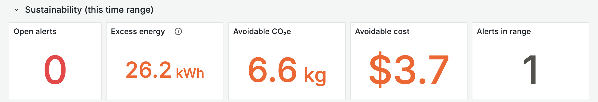
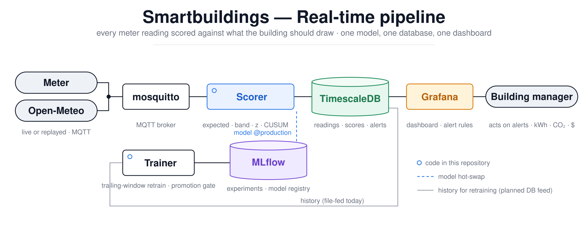

# Smartbuildings — real-time contextual energy anomaly detection

Learns what a building *should* draw for the current time and weather, scores every 15-minute
meter reading against it as it arrives, and raises direction-aware alerts on Grafana — **too high =
waste, too low = failure** — with the avoidable energy translated to CO₂e and cost.


*Real 15-min meter data replayed through the live pipeline (no synthetic values). Blue = metered demand;
orange dashed = expected demand for that time and weather, adjusted for the building's recent level;
shaded band = the 90 % normal range; red = alerts. Below: the residual in σ and the CUSUM that
catches sustained deviations.*



*Excess energy above the normal band, summed over the selected range, times the grid emission factor
and tariff (both editable on the dashboard — the defaults are placeholders).*

## How it works



- **Model** — LightGBM quantile regression (q05/q50/q95) on calendar (cyclic time-of-day, weekday,
  day-of-year, holidays) and weather (temperature, humidity, wind, pressure, heating/cooling degrees).
  No demand lags: the model answers *what should this building draw now*, so a sustained anomaly
  never becomes "normal" within hours.
- **Band** — one scalar calibration so the band covers 90 % of ordinary readings; a slow level
  tracker (3-day half-life, robust to anomalies) follows genuine regime changes.
- **Rules** — `SPIKE` (one reading > 5σ), `SUSTAINED_HIGH/LOW` (CUSUM), `STUCK` (2 h identical).
  Each alert carries observed vs expected kW, excess kWh → CO₂e/$, and the top-3 SHAP drivers of the
  expectation.
- **Evaluation without labels** — six anomaly types injected into a held-out year, event-level
  recall / false alarms per week / time-to-detect, against a seasonal-naive baseline sharing the
  same rules. Splits are strictly temporal: train 2016–17 · calibrate 2018 · test 2019 · replay
  2020-01 → 2021-05.
- **Operations** — MLflow registry with a promotion gate, scorer hot-swap, nightly retrain on a
  trailing window, one Grafana dashboard whose health row is plain SQL on the `scores` table.

## Run it

```
make setup      # uv sync + pre-commit
make test       # unit tests
make up         # mosquitto + timescaledb + mlflow + grafana + scorer   (Docker Compose)
make train      # train + calibrate in the stack → MLflow @staging
make eval       # evaluate vs baseline on the held-out year; promotes @production on PASS
make backfill   # load the whole 2020-01 → 2021-05 history fast (background)
make live       # human-paced demo: one building day per ~15 min   (START=… INJECT=sustained_offset)
make retrain    # trailing-window retrain with promotion gate  (AS_OF=YYYY-MM-DD)
```

Grafana http://localhost:3000 (view without login; admin/admin to edit) · MLflow http://localhost:5001 ·
scorer http://localhost:8001/health

Data files live in `data/raw/` (gitignored): `demand.csv` (15-min kW, 2015–2021) plus weather
fetched from Open-Meteo with `make weather`. Design, phases and decisions: `docs/PLAN.md`.
Operating guide for building managers: `docs/runbook.md`.

## Connecting a real meter

Publish `{"meter_id": "...", "ts": "<ISO-8601 with offset>", "kw": <float>}` to
`building/<meter_id>/demand` (QoS 1) and weather to `weather/<station_id>/obs`. Nothing downstream
changes; the broker and database are `.env` settings.

## Development notes

Built by Daniel Berhane Araya with Claude Code as a pair-programming assistant. The problem framing,
design goals, model choice, evaluation protocol and every recorded trade-off are in `docs/PLAN.md`;
the code was developed test-first (100+ unit tests, one integration test) and independently reviewed
before publication. The original 2022–2025 notebook prototype is preserved unchanged in `legacy/`.
