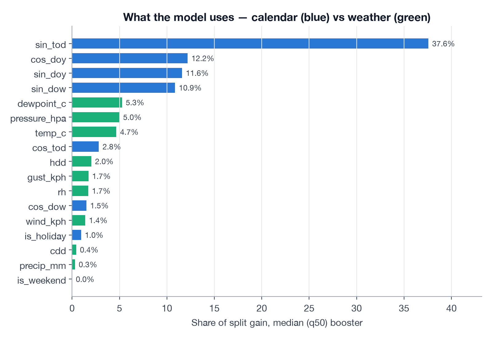
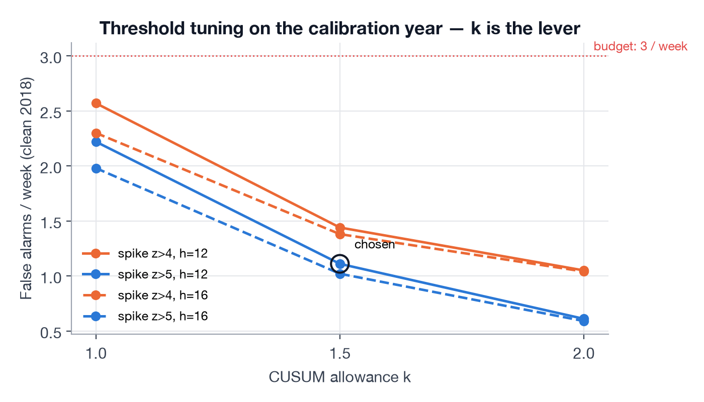
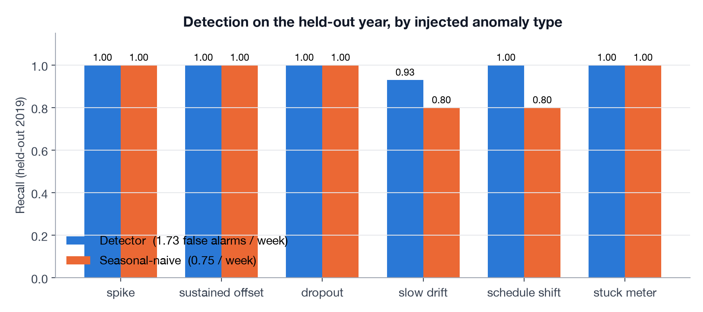

# Contextual anomaly detection for building energy — data, features, model, evaluation, deployment

*A technical write-up of the Smartbuildings project. Every figure comes from the repository at the commit this document ships with and is reproducible with the commands in Appendix A. Where a number was produced once and then a design decision changed, the text says so.*

> **TL;DR.** One building, one 15-minute meter, six years of readings, no labelled anomalies. A context-only LightGBM quantile model predicts what the building *should* draw for the time and weather; a calibrated band, a robust level tracker and a winsorised CUSUM turn the signed residual into three kinds of alert. On a held-out year it catches 93–100 % of six injected anomaly types at **1.7 false alarms per week** (budget: 3), reacts to a sustained offset in 12 minutes, and beats a seasonal-naive baseline on every type. Replayed live through MQTT → TimescaleDB → Grafana, it surfaces the 2020 lockdown as weeks of "below expectation" without being told. Four of its design decisions came from watching a first version fail — those failures are the most useful part of this document.

This is a return to a problem I worked on in 2017: [*An ensemble learning framework for anomaly detection in building energy consumption*](https://www.sciencedirect.com/science/article/pii/S0378778817306904) (Araya, Grolinger, ElYamany, Capretz & Bitsuamlak, *Energy and Buildings* 144, 191–206). That paper combined a **pattern-based** classifier — the CCAD-SW autoencoder on overlapping sliding windows — with **prediction-based** classifiers by majority vote, and judged everything by sensitivity and false-alarm rate. The notebook this project inherited was a direct descendant of the pattern-based branch. The system described here takes the prediction-based branch as its core, keeps the two metrics, and adds what a deployed system needs and a paper does not: calibration, adaptation to regime change, a promotion gate, and a dashboard a building manager can act on.

---

## Contents

1. The problem and the operational constraint
2. What was inherited, and what it taught
3. Data: sourcing, profiling, cleaning
4. Feature engineering
5. Model selection
6. Calibration: from quantiles to a band
7. From residual to alert: the rules, and how they failed first
8. Evaluation without labels
9. Results
10. Deployment
11. Monitoring, drift and retraining
12. What the code review found
13. Limits, open questions, next steps
14. Lessons

Appendix A — reproducing the numbers · Appendix B — glossary of the scoring quantities

---

## 1. The problem and the operational constraint

A building's electric demand is a function of its **context**: time of day, day of week, season, holidays and weather. An anomaly is therefore not "a high reading" but a reading that is unusual *for its context*. 280 kW at 2 a.m. on a Sunday in April is a problem; 280 kW at 2 p.m. on a hot July Tuesday is normal.

For a sustainability programme the *direction* of the deviation carries the meaning:

| Direction | Typical cause | What the manager does | What we quantify |
|---|---|---|---|
| Too high for context | HVAC or lighting left running, schedule error, an occupancy event nobody planned for | goes and switches something off, fixes a schedule | excess kWh → CO₂e → cost |
| Too low for context | equipment failure, metering or communications fault, unplanned closure | raises a maintenance ticket | duration, deficit |

Two hard constraints shaped the design more than any modelling choice:

- **There are no labels.** Nobody recorded when the HVAC was left on. Any claim about detection performance has to be constructed, and the construction has to be honest.
- **The alert budget.** A building manager will act on a handful of alerts a week. Beyond roughly three false alarms per week a dashboard becomes wallpaper. This number — 3/week — is written into the promotion gate.

Design goals were set explicitly and in priority order before building: simplicity (one model, one database, one dashboard), maintainability, ease of use, reproducibility, clear boundaries, config over code, fail-safe defaults, observability by construction, extensibility, secrets out of the repository. Several later decisions ("do not add a lag model", "no Prometheus", "gate on recall not F1") trace directly back to that list.

## 2. What was inherited, and what it taught

The starting point was a Jupyter notebook developed 2022–2025: an H2O deep autoencoder (`[25, 14, 6]`, tanh, L1 = 1e-4) trained on hourly sliding windows of five 15-minute demand readings plus weather and cyclic time features, scored by reconstruction MSE and evaluated with a ROC curve against synthetic anomalies drawn from Burr and Fisk distributions fitted to peak- and low-demand hours.

It contained good ideas that survive in the new system — cyclic time encodings, seasonal weather imputation, a complete 15-minute timestamp grid, the selection of 2016–2019 as a stable regime, and the idea of synthetic positives validated with a Kolmogorov–Smirnov test. It also contained three defects that invalidated its headline result, and each drove a design rule:

**Leaky split.** `StratifiedShuffleSplit` on (hour, month, weekday) shuffles rows at random. Adjacent windows share four of their five demand values, so roughly 80 % of every test window's content was also in the training set. A reconstruction model that has seen four-fifths of the answer reconstructs well; the ROC was meaningless. *Rule: split by time, never shuffle a time series, and test on a whole year.*

**Imputation fit on everything.** The (month, hour) weather means were computed on the full frame before splitting, letting test-period information into training features. *Rule: every fitted transformation is fit on the training years only and serialised with the model.*

**Direction-blind score.** Reconstruction MSE squares and averages residuals across sixteen inputs; +80 kW and −80 kW produce the same score, and the score does not say which input deviated. For a waste-versus-failure use case that is the whole point. *Rule: predict the expected value and score the signed residual.*

The notebook's own correlation table pointed to a fourth issue: the five windowed demand values correlated 0.96–0.97 with the hourly mean, while the strongest context feature (hour) reached 0.48. The autoencoder had mostly learned *demand ≈ its neighbours*. Any detector fed its own recent demand will drift toward that solution — the reason the new model uses no demand lags (§4.4).

## 3. Data: sourcing, profiling, cleaning

### 3.1 Demand

Source: a single building's electricity meter, 15-minute interval, `2015-01-01 05:00` → `2021-05-31 03:45` local time. **221,387 readings**, mean 235, standard deviation 26, range 118–391 (units are assumed to be kW; see §13).

Profiling ran before any modelling, because half the notebook's problems were data handling:

| Property | Finding | Handling |
|---|---|---|
| Duplicated timestamps | 0 | keep-last rule anyway |
| Non-positive readings | 0 | assert `kw > 0` on load — a meter never reports zero or negative load, so it is a data error, not an anomaly |
| Missing slots | **1.53 %** (3,441 of 224,828 grid slots) in **200 gaps** | kept as `NaN` on a complete grid, never dropped |
| Gap length | 6 gaps > 1 day; longest **307 h** (29 Mar → 11 Apr 2020) | `gap_report()` tabulates them; alert rules ignore `NaN` slots without touching state |
| Yearly level | 2015 mean **258.7 kW**; 2016–2019 **233–239**; 2020 **210.2**; 2021 **222.9** | 2015 excluded from training; the 2020 drop is the replay's natural test |

Gaps by year inside the modelling window are informative on their own: 2016 had 24 gaps totalling 1,154 slots (longest 126 h), 2019 had 107 gaps totalling only 118 slots (longest 2 h) — the meter's communications improved over time, and short dropouts became the norm. Any detector has to be indifferent to a single missing slot.

**Time zone.** Timestamps are naive local time (America/New_York). A 15-minute grid built in local time is wrong twice a year: the 1 a.m. hour occurs twice in November and the 2 a.m. hour does not exist in March. The notebook ignored this. The system localises with `ambiguous="NaT", nonexistent="NaT"` and drops the affected readings (52 in 6.5 years — the source gives no way to know which occurrence a November reading belongs to), converts to UTC for storage and the grid, and converts back to local time only to compute calendar features. All database timestamps are `timestamptz`.

**Daily shape** (training years, local time): weekday mean 241.6 kW vs weekend 229.3 kW; the daily minimum is at 07:00 (222.5 kW) and the maximum at 19:00 (256.0 kW).


*Figure 1. Mean demand by time of day, 2016–2017. This is not an office profile — an office peaks mid-afternoon and empties after 18:00. An evening peak with a shallow morning trough is closer to residential or mixed-use behaviour. The model does not need to be told which; the features let it learn the shape.*

### 3.2 Weather

Two scraped Weather Underground exports were in the repository, both produced by Selenium scrapers that parsed the site's HTML: a **metric** one (2016-01 → 2020-02; °C, hPa) and an **imperial** one (2015–2019; °F, inHg, mph). They overlapped in years, disagreed in units, contained `Pressure == 0` where the sensor had returned nothing, had a 294 km/h "gust", and ended fourteen months before the demand data. As a production source, a scraper is the weakest link imaginable: it breaks on any front-end change and needs a browser.

The system uses the **Open-Meteo historical archive** (ERA5/ERA5-Land reanalysis, free, no key) for the building's location (42.44 N, −76.50 W): **56,232 hourly rows**, 2015-01 → 2021-05, seven variables — temperature, dew point, relative humidity, wind speed, wind gusts, surface pressure, precipitation — requested in metric units. It also has a forecast and current-conditions API for the live case.

Reanalysis is a model, not a thermometer, so it was validated against the station export on the **35,808 overlapping hours**:

| Variable | r | MAE | Interpretation |
|---|---|---|---|
| temperature | **0.984** | 1.95 °C | excellent |
| dew point | **0.983** | 1.66 °C | excellent |
| surface pressure | **0.978** | 25 hPa | a constant offset (station altitude vs modelled surface); harmless for a tree model, which only sees rank order within the training range |
| relative humidity | 0.795 | 8.8 % | fair |
| wind speed | 0.767 | 4.6 km/h | fair |
| gusts | 0.621 | 24 km/h | the *station* column is mostly zeros — it only recorded gusty hours; the export is the unreliable one |
| precipitation | 0.310 | 0.14 mm | reanalysis precipitation is spatially coarse; treated as a weak feature |


*Figure 2. Open-Meteo reanalysis against the scraped station export on 35,808 overlapping hours. Temperature — the variable that matters most — agrees to r = 0.98; the dashed line is y = x.*

The station CSVs remain as an offline fallback behind a loader that normalises units (°F→°C, inHg→hPa, mph→km/h, in→mm) and nulls the impossible values.

**Alignment to the grid.** Station observations arrive at irregular minutes (07:56, 08:30, 08:56); Open-Meteo is on the hour. Observations are rounded to the hour (keep-last on collisions) and forward-filled onto the 15-minute grid for at most four slots, so an hour with no observation stays `NaN` and is handled by the imputer rather than by a stale value carried across a gap. The notebook's approach — repeat each hourly row four times and glue on minute labels — was replaced by `reindex().ffill(limit=4)`.

### 3.3 Splits

| Split | Period | Rows (non-missing) | Used for |
|---|---|---|---|
| train | 2016-01-01 → 2017-12-31 | 68,538 | boosters, weather imputer |
| calibrate | 2018 | 34,974 | band factor and **every** rule threshold |
| test | 2019 | 34,922 | one evaluation with injected anomalies |
| replay | 2020-01-01 → 2021-05-31 | 48,172 | streamed through the live system |

`temporal_split()` refuses overlapping or out-of-order bounds. Testing on a full year rather than a quarter matters: a draft plan tested on 2020-Q1, which would have evaluated every anomaly type in winter only.

## 4. Feature engineering

Fourteen features, all computable from the timestamp and the current weather observation. Nothing about the demand itself.

### 4.1 Calendar, in local time

Cyclic quantities are encoded as a point on a circle so that the model's notion of distance matches reality — 23:45 is next to 00:00, December is next to January, Sunday is next to Monday:

```
sin_tod, cos_tod = sin(2π·m/1440), cos(2π·m/1440)     m = minute of day (0…1439)
sin_dow, cos_dow = sin(2π·d/7),    cos(2π·d/7)        d = day of week
sin_doy, cos_doy = sin(2π·y/365.25), cos(2π·y/365.25) y = day of year
```

Trees can split a raw hour just fine; the reason to encode cyclically is the wrap-around — a raw `hour` feature has to spend two splits to isolate "23:00–01:00", and a raw `day_of_year` places 31 December and 1 January at opposite ends of the range. Minute-of-day is used rather than hour plus a minute one-hot (the notebook's approach) because a single smooth variable lets the model place a split at 07:15 if that is where the building wakes up.

`is_holiday` (US federal, via the `holidays` package) and `is_weekend` are explicit flags. Holidays cover 2,208 training slots (23 days). Both are computed on the *local* date — 4 July 23:00 local is 5 July 03:00 UTC, and a test guards that it still counts as the holiday.

### 4.2 Weather

The seven Open-Meteo variables enter directly, plus two derived terms:

```
hdd = max(18 − T, 0)      heating degrees: how far below the comfort band it is
cdd = max(T − 22, 0)      cooling degrees: how far above
```

Buildings respond to temperature piecewise: nothing between roughly 18 and 22 °C, then linearly in each direction. Giving the model the two half-lines directly means it does not have to discover the kink from splits on raw temperature, and it makes the two behaviours separable when one of them is weak. Training temperatures span −23.3 to 33.9 °C, so both regimes are well covered.

Wind speed and gusts, humidity, dew point and pressure are kept even though several are weak: they are cheap, the model can ignore them, and pressure and humidity correlate with the cloud cover and precipitation that the coarse `precip_mm` measures badly. The 45-category `Condition` text from the station export ("Light Snow / Windy") was dropped: the information it carries is in the numeric variables, and a categorical with 45 levels from a scraped source is a maintenance liability.

### 4.3 Missing weather

`SeasonalMeanImputer` fills a missing variable with the **training-period mean for that (month, hour) in local time**, falling back to the global training mean for a cell never seen in training. Weather is seasonal and diurnal; a 7 a.m. January temperature imputed from a January-7-a.m. mean is a far better guess than a global mean, and far better than carrying forward yesterday's value across a multi-day gap. The imputer is fit on 2016–17 only and is part of the saved model artefact. In live operation the scorer also uses it when the weather feed is stale (§10.2).

### 4.4 What is deliberately not a feature: demand lags

A lag feature (`kw` fifteen minutes ago, same slot yesterday, same slot last week) is the single most predictive input for a forecaster. It was excluded on purpose, and the choice is the central design decision of the model:

- A model with lags answers *what will the next reading be*; a context model answers *what should this building be drawing now*. The second is the question a sustainability programme asks.
- With lags, a sustained anomaly becomes the model's "normal" within a few readings — the +30 % overnight HVAC event, the one that costs the most kWh, is exactly the one a lag model stops seeing.
- Everything a lag model would have contributed for slow level changes is provided by the level tracker (§7.2), which adapts over days rather than minutes and is robust to anomalies by construction.

The cost is sensitivity to *small* offsets: the context model's band (σ ≈ 9 kW, ~4 % of load) is wider than a lag model's would be, so offsets under roughly 8 % are below detection by design. A second, lag-based model behind the same `Detector` interface is the documented extension if that ever matters (§13).

### 4.5 What the model actually used

Linear correlations with demand on the training set and LightGBM gain importance for the median booster:

| Feature | r with kW | Gain share (q50) |
|---|---|---|
| sin_tod | −0.641 | **37.6 %** |
| cos_doy | 0.080 | 12.2 % |
| sin_doy | 0.083 | 11.6 % |
| sin_dow | 0.247 | 10.9 % |
| dewpoint_c | −0.076 | 5.3 % |
| pressure_hpa | −0.031 | 5.0 % |
| temp_c | 0.029 | 4.7 % |
| cos_tod | 0.036 | 2.8 % |
| hdd | 0.034 | 2.0 % |
| gust_kph | 0.112 | 1.7 % |
| rh | −0.265 | 1.7 % |
| cos_dow | −0.101 | 1.5 % |
| wind_kph | 0.055 | 1.4 % |
| is_holiday | −0.081 | 1.0 % |
| cdd | 0.215 | 0.4 % |
| precip_mm | −0.005 | 0.3 % |
| is_weekend | −0.291 | 0.0 % |



*Figure 3. Share of split gain in the median booster. Calendar features in blue, weather in green.*

Three things worth noticing. Time of day dominates, as it should. The day-of-year pair carries 24 % of the gain while its linear correlation is near zero — seasonality is real but non-monotonic, which is precisely the case where trees beat a linear model and where cyclic encoding earns its place. And `is_weekend` has zero gain despite a −0.29 correlation: the model gets the same information from `sin_dow`, so the flag is redundant (harmless, and kept for readability of SHAP explanations).

Weather matters less than intuition suggests for this building: temperature, dew point and pressure together take ~15 % of the gain. That is consistent with an evening-peaking load driven by occupancy rather than a chiller-dominated office.

## 5. Model selection

### 5.1 The requirement

The detector needs, for every 15-minute slot, an **expected value** and a **normal range** given the context — and it needs them to be explainable in one sentence to a non-engineer. That requirement rules out the family the project started with.

### 5.2 Candidates

**A — Residual-based (chosen).** Predict conditional quantiles of demand from context with gradient-boosted trees; the anomaly signal is the signed, standardised residual of the observation against the median, with the 5–95 % quantiles giving the band.

**B — Autoencoder (the incumbent).** Reconstruction error of a window plus context. Direction-blind (§2); the threshold is a number on an error scale nobody can interpret; and its inputs include the demand itself, so it learns neighbours. It *can* catch within-hour shape anomalies (an oscillating compressor) that a point model cannot. Kept as a possible second signal, not the core.

**C — Ensemble A + B.** Marginally more recall on a single meter for twice the operational surface and two thresholds to explain.

**Why boosting rather than a neural forecaster** (LSTM, TFT, N-HiTS): ~70,000 training rows of tabular features is the regime where gradient boosting is consistently at or above neural models in the forecasting literature and in the M5 competition; quantile loss gives calibrated bands natively where an LSTM would need a quantile head or conformal wrapper; SHAP on trees is exact and takes microseconds, which is what makes the alert text possible; and training takes about ten seconds on a laptop CPU, which makes nightly retraining a non-event. Deep models earn their place with many buildings (a global model) or sub-minute data — neither applies here.

**Why quantile regression rather than mean regression plus a residual σ.** The band should be heteroscedastic: the building is more variable at 19:00 than at 04:00, and more variable in a heat wave than in mild weather. Three quantile boosters learn that structure directly. On the calibration year the raw half-width's 10th–90th percentile range is 7.8–16.6 kW around a median of 9.1 — a factor of two between quiet and busy contexts that a constant σ would get wrong in both directions.

### 5.3 The model

Three LightGBM regressors, `objective="quantile"` at α = 0.05, 0.50, 0.95; 800 trees, learning rate 0.03, 31 leaves, `min_child_samples = 50`. The pinball loss the model minimises:

```
L_α(y, q) = α·(y − q)          if y ≥ q
          = (α − 1)·(y − q)    otherwise
```

Predicted quantiles are re-sorted row-wise so that `q05 ≤ q50 ≤ q95` (quantile crossing is rare but real with independently fitted boosters). Fit on the training years, the median model's calibration-year error is **MAE 9.9 kW** on a 235 kW mean (4.2 %), pinball loss 4.97 at the median.

## 6. Calibration: from quantiles to a band

Independently fitted quantile models are almost always overconfident out of sample. On 2018 the raw 5–95 % band covered only **59.9 %** of readings. Calibration adds one scalar `c` chosen so the band covers the target 90 % on the calibration year:

```
half = c · (q95 − q05) / 2         lower, upper = expected ∓ half
σ    = half / 1.645                z = (y − expected) / σ
```

Dividing by 1.645 rescales the calibrated half-width to a standard-normal-equivalent σ, so `|z| > 4` means what it sounds like. A per-(hour, weekday) σ table and a full split-conformal procedure were considered and rejected: one scalar on top of heteroscedastic quantiles captured the structure, and a test asserts calibration-year coverage is 0.90 ± 0.02.

**What the residual is measured against turned out to matter more than the method.** The first version fit `c` on the raw residual `y − q50` and got **c = 2.12**. After the level tracker was introduced (§7.2) and calibration was made to use the same level-adjusted residual the scorer uses, `c` fell to **1.59**. The difference — a third of the band's width — was the year-scale level drift that the raw residual contained and the tracker removes. Full story in §7.3.

## 7. From residual to alert: the rules, and how they failed first

### 7.1 The first attempt and its diagnosis

The obvious detector: `SPIKE_HIGH/LOW` when `|z| > 4` on a single slot; a two-sided **CUSUM** on z (allowance k = 0.5, threshold h = 5) for sustained deviation; `STUCK` for eight identical consecutive readings. On the held-out year it fired **12 false alarms per week** — 626 alert events, 9,462 slots of `SUSTAINED_LOW` alone.

Diagnosis on the 2019 z series:

- lag-1 autocorrelation **0.80**, lag-96 (one day) 0.45;
- monthly mean z from **−1.48 in January to +0.57 in November**; overall mean −0.42 — 2019 ran lower than 2016–17 in the same contexts;
- daily-mean z had σ = 0.88; on 96 of 366 days the day's mean |z| exceeded 1.


*Figure 4. Monthly mean of z on the held-out year. Orange: the raw residual against the 2016–17 model — the building runs 1.5σ low in January and 0.6σ high in November. Blue: the same residual after the level tracker of §7.2. CUSUM sees the blue line.*

A context-only model trained on 2016–17 cannot know that the building runs 1.5σ lower in January 2019 than in January 2017. CUSUM with k = 0.5 correctly accumulates any persistent bias above 0.5σ and flagged entire months. Correct mathematics, useless alerts.

Two textbook defaults were also wrong for this cadence. Two-sided CUSUM with k = 0.5, h = 5 has an in-control average run length of roughly 465 steps on *white noise*. At 96 readings a day that is a false "sustained" alert every five days in each direction before any real structure is considered — the unit test that fed 1,000 N(0,1) values into it failed, which is how the defect was found. And a single enormous reading (z = 30) tripped CUSUM on its own and was labelled "sustained".

### 7.2 Level tracking

The fix that preserved the one-model design: a **slow, robust exponentially weighted moving average of the kW residual** tracks the building's current level relative to the model. Expectation, band and z are computed relative to it:

```
expected  = q50 + level_kw
z         = (y − expected) / σ
level_kw += α · clip(y − expected, −2σ, +2σ)        α = 1 − 0.5^(1 / (3 days · 96))
```

Four properties, each the result of a failed test rather than a prior:

1. **Track in kW, not in z.** The first version tracked the bias in σ-units. Because σ varies with context (§5.2), `bias·σᵢ` produced a different kW correction at every slot and left a ±2σ daily oscillation after a pure level shift. A level shift is a kW quantity.
2. **Clip each update at ±2σ.** Unclipped, a +30 % offset lasting six hours pulled the level up by ~0.9σ, so the return to normal produced a *rebound* `SUSTAINED_LOW` alert. Clipped, an anomaly can move the level by at most 2σ·α per slot — about 0.14σ over a six-hour event — while a permanent −20 kW shift is still fully absorbed within one to two weeks.
3. **A 3-day half-life.** Long enough that no realistic anomaly is absorbed before it alerts; short enough that a genuine regime change (a retrofit, a lockdown) stops alerting within a week. Anything persisting beyond that *is* the new normal, and the nightly retrain will learn it properly.
4. **Winsorise the CUSUM input at the spike threshold.** With z clipped to ±5 before accumulation and k = 1.5, one slot contributes at most 3.5 toward h = 12, so `SUSTAINED` genuinely means at least an hour of deviation and a single spike can never masquerade as one.

One more rule of alert hygiene: **`SUSTAINED` supersedes `SPIKE` in the same direction.** A spike that keeps going *is* the sustained event; the manager should see one alert, and the spike record is closed when the sustained one opens.

### 7.3 Calibrating on the same residual the scorer scores

This inconsistency was found by the promotion gate, not by inspection. The first automated retrain (as-of 2020-09-01) calibrated its band on March–May 2020 — the lockdown. Raw residuals in a regime break are enormous, so `c` blew up and the candidate's band covered **100 %** of readings and detected nothing. The gate refused it (§11.3).

The cause: the scorer judged *level-adjusted* residuals while the calibrator was fit on *raw* ones. Both now share one `track_level()` routine; the calibration factor is fit on `y − level` with a three-step fixed-point iteration (the tracker's clipping depends on σ, which depends on `c`). A unit test asserts that the coverage reported at calibration equals the coverage `Detector.score()` realises on the same frame across a −30 kW mid-window break; they now agree within 0.015, where before the fix they differed by 0.04. The same test suite pins that batch scoring and one-reading-at-a-time scoring produce identical output, so what is evaluated is what runs.

### 7.4 Threshold selection — on 2018 only

With level tracking in place, a small grid was evaluated with injected anomalies on the **calibration** year. 2019 was not touched during tuning.

| k | h | spike z | FA/week (clean 2018) | recall: offset · dropout · spike · drift · schedule |
|---|---|---|---|---|
| 1.0 | 12 | 4 | 2.57 | 1.0 · 1.0 · 1.0 · 1.0 · 1.0 |
| 1.0 | 16 | 5 | 1.98 | 1.0 · 1.0 · 1.0 · 1.0 · 1.0 |
| **1.5** | **12** | **5** | **1.11** | **1.0 · 1.0 · 1.0 · 1.0 · 0.83** |
| 1.5 | 16 | 5 | 1.02 | 1.0 · 1.0 · 1.0 · 1.0 · 0.83 |
| 2.0 | 12 | 5 | 0.61 | 1.0 · 1.0 · 1.0 · 1.0 · 0.83 |



*Figure 5. False alarms per week on the clean calibration year for each rule setting. Recall was 1.0 on five of six types for every point shown; the chosen setting is circled.*

`k` — the allowance, how much persistent bias CUSUM tolerates — is the dominant lever; `h` and the spike threshold are second-order. k = 1.5 was chosen over 2.0 to keep sensitivity to offsets around +10 % (the overnight-waste case), accepting roughly half an extra false alarm a week. Final rules: `spike_z = 5`, `cusum_k = 1.5`, `cusum_h = 12`, `stuck_slots = 8`, alerts close after 8 consecutive in-band slots, level half-life 3 days.

## 8. Evaluation without labels

### 8.1 Injection

Anomalies are injected into the **raw** demand series before anything else runs, so imputation, level tracking and the rules all see what production would see. Six types, chosen to span what a facilities team actually encounters:

| Type | Simulates | Injected as | Detection challenge |
|---|---|---|---|
| spike | transient load, meter glitch | one slot × U(1.3, 2.0) | must not be swallowed by smoothing |
| sustained_offset | HVAC/lighting left on | +U(15, 40) % for 2–12 h | the core waste case |
| dropout | equipment failure | −U(30, 60) % for 1–6 h | direction |
| slow_drift | degradation, fouling | linear ramp to +14 % over 14 days | the hardest: must not be absorbed as level |
| schedule_shift | day profile running at night | one day's readings rolled by 6 h | net energy unchanged — only context reveals it |
| stuck_meter | comms/metering fault | constant value for 2–6 h | not a deviation at all |

Three of each per seed, five seeds, placed at least a day apart (longest types first, so fourteen-day drifts are not squeezed out by earlier short placements) — 90 labelled events per evaluation, on top of a year of real behaviour. The notebook's Burr/Fisk generator survives as an optional seventh type.

### 8.2 Metrics

Event-level, not slot-level. A labelled event is **detected** if any alert event overlaps it within ±1 hour; **time-to-detect** is the delay from onset to the first overlapping alert slot. On the clean, un-injected year: **false alarms per week** (alert events not overlapping any label) and **band coverage** (share of readings inside the band).

Precision and F1 are computed and logged but are *not* used for decisions. With three injected events per type against a full year of real alerts, F1 is a proxy for the false-alarm count with extra steps; recall per type, false alarms per week, time-to-detect and coverage are the four numbers an operator would ask for.

### 8.3 Baseline

A **seasonal-naive** detector: expected demand = the reading at the same slot last week (falling back to the (weekday, slot) mean), σ = the (weekday, slot) standard deviation from the fit period — run through the *same* calibrator and the *same* alert rules. The only thing that differs is where the expectation comes from, so the comparison isolates what the model contributes. This baseline is strong on a stable building and is the one most practitioners would reach for first.

### 8.4 Guardrails

- Thresholds were set on 2018; 2019 was scored for the report.
- Injection parameters are randomised with fixed seeds and were not adjusted to what the detector catches.
- The whole 2016–2021 series was scored once as a sanity check for the two regime changes nature labelled (§9.3); no parameter was changed as a result.
- Disclosure: the 2019 evaluation was run **twice** — before and after the calibration change of §7.3 — so the final 2019 numbers should be read as post-one-revision rather than pristine.

## 9. Results

### 9.1 Held-out year, 2019

| | Detector | Seasonal-naive |
|---|---|---|
| False alarms / week, clean | **1.73** | 0.75 |
| Band coverage, clean | 0.81 | 0.88 |
| Recall — spike | 1.00 | 1.00 |
| Recall — sustained offset | 1.00 · **12 min** to detect | 1.00 · 54 min |
| Recall — dropout | 1.00 · 0 min | 1.00 · 0 min |
| Recall — slow drift | **0.93** · ~2.5 days | 0.80 · ~6 days |
| Recall — schedule shift | **1.00** · ~4.4 h | 0.80 · ~7.4 h |
| Recall — stuck meter | 1.00 · 96 min | 1.00 · 105 min |



*Figure 6. Recall per injected anomaly type on the held-out year, detector vs seasonal-naive baseline, with each detector's false-alarm rate on the clean year in the legend.*

Read carefully:

- Within the 3/week budget, the detector catches everything the baseline catches, catches drift and schedule shifts the baseline misses, and reacts four to five times faster to offsets. Schedule shift is the case that separates them most cleanly: the baseline compares to last week's reading at the same slot, so a building running its day profile at night looks plausible if it did so last week too; only the context model knows that 02:00 on a Tuesday should be quiet.
- The baseline is *quieter* — 0.75 false alarms a week — because "last week's reading" already contains the building's current level. It pays with blindness to anything that also happened last week and with slower reaction.
- **Coverage 0.81** for a band calibrated to 0.90 on 2018 is a real finding: a model frozen at end-2018 fits 2019 measurably worse (the raw quantile band's calibration-year coverage was 0.60; the level tracker and factor bring it to 0.90 in-year, 0.81 the year after). It is the quantitative case for retraining (§11).

### 9.2 Threshold-tuning result, 2018 (the calibration year)

For completeness — the chosen rules on the year they were tuned on: 1.11 false alarms/week, coverage 0.90, recall 1.0 on five types and 0.83 on schedule shift. The 2019 numbers are worse on false alarms and coverage, as an honest out-of-year result should be.

### 9.3 The only natural labels: two regime changes

Scoring 2016–2021 with the 2018-calibrated model and counting alert slots by month gives a picture the model was never told about: almost nothing in the training years (a handful of spikes), sparse alerts through 2018–19, then `SUSTAINED_LOW` exploding in **March 2020 (939 slots) and April (1,260 slots)** — the lockdown — before the level tracker adopts the new regime. Alert density stays elevated through 2020–21 with the frozen model, the qualitative form of the coverage finding above.

### 9.4 The replay through the live system

The complete 2020-01 → 2021-05 period — real readings only, no injection — streamed over MQTT into the deployed stack: **48,173 score rows for 48,172 readings** (the extra row is a boundary slot), zero message loss, ~15 ms scoring latency per reading. Alerts per month:

| Month | Alerts | LOW | HIGH | Excess kWh | Note |
|---|---|---|---|---|---|
| 2020-01 | 14 | 6 | 8 | 102 | ~3/week, consistent with 2019 evaluation |
| 2020-02 | 9 | 1 | 8 | 211 | |
| 2020-03 | 16 | **13** | 3 | 33 | lockdown begins; mean alert duration 34 h |
| 2020-04 | 20 | **14** | 6 | 54 | |
| 2020-05 | 31 | 2 | **29** | 816 | partial reopening reads as *high* against the newly learned low level |
| 2020-06 → 2021-05 | 8–26 / month | | | | elevated vs 2019 with a model two years stale |


*Figure 7. Alert events per month from the live replay of real readings, coloured by direction. The frozen 2018 model sees the lockdown as weeks of "below expectation", then partial reopening as "above" the newly learned level.*

The March–May 2020 sequence is exactly what a manager would want explained on the dashboard: first "the building is running far below what it should" for weeks, then "it is running above what it just was". Whether the second wave is *useful* depends on the question being asked — it is correct relative to the recent level, and it is the strongest argument in the project for retraining on a trailing window rather than running a frozen model.

## 10. Deployment

### 10.1 Shape

Five always-on containers, two on demand, one image, one `docker compose up`:

```
Meter / Open-Meteo ──MQTT──▶ mosquitto ──▶ Scorer ──▶ TimescaleDB ──▶ Grafana ──▶ building manager
                                              ▲                │
                                      MLflow registry ◀── Trainer ◀── history
```

Choices worth defending:

- **MQTT as the single integration contract.** Topic `building/<meter_id>/demand`, payload `{"meter_id", "ts", "kw"}` with an ISO-8601 timestamp *including offset* (naive timestamps are rejected — nobody should guess a time zone twice), QoS 1. Weather on `weather/<station_id>/obs` with the seven metric variables. A real meter gateway and the replay simulator publish identical messages; swapping mosquitto for a managed broker is a `.env` change.
- **TimescaleDB rather than a document store.** Every question the dashboard asks is a time-range aggregate over 15-minute rows; hypertables and plain SQL are the natural fit, and Grafana's Postgres datasource needs no glue. Three hypertables (`readings`, `weather_obs`, `scores`) and two tables (`alerts`, `model_versions`).
- **One scoring path.** `Detector.score()` serves offline evaluation, the live scorer and the MLflow pyfunc wrapper.
- **No Prometheus, no Evidently.** Service health and model health are SQL over `scores` (§11.1). A second metrics stack would have been the first violation of the "one database" goal.

### 10.2 The scorer

A transport- and storage-agnostic `ScorerCore` behind a `Sink` protocol (unit-tested with an in-memory sink), wrapped by a thin paho-mqtt consumer and a FastAPI app exposing `/health` and `/reload-model`. Per meter it keeps the level, CUSUM sums, stuck-run counter and open alerts; one lock guards all state.

Behaviour under the failure modes that actually occurred:

- **Stale weather** (> 3 h old or absent) → features fall back to the seasonal-mean imputer and the score row is flagged `weather_stale`; never a crash.
- **Out-of-order or duplicate readings** → dropped with a warning. A reading more than a day *older* than the last one is treated as a replay restart and resets that meter's state — found when a truncated database plus a running scorer rejected 1,439 readings.
- **Database restart** → the sink reconnects once and retries; before this fix (a code-review finding) every reading after a Postgres restart was silently dropped forever while the container stayed "healthy".
- **Fast replays** → mosquitto's default 1,000-message per-client queue dropped 75 % of readings when a 1,000,000× replay outran a ~25 reading/s scorer; the queue is now unbounded and the sustainable backfill speed is ~30,000× (17 months in ~40 minutes).
- **Every alert record** carries observed vs expected kW, peak z, accumulated excess kWh → CO₂e → cost, the model version, and the top-3 SHAP drivers of the expectation ("time of day +38 kW, weekday +12, temperature −6") so the manager sees *why the model expected what it expected* — the explanation of the baseline, not the cause of the anomaly.


*Figure 8. Two days of real readings with a +25 % offset injected from 03:15 to 14:00 on 2 January. The alert opens on the first anomalous reading and closes at 15:45, after eight consecutive in-band readings. The small alert at noon on 1 January is the building's own New Year's Day behaviour. Note the band lifting slightly during the offset — the level tracker's clipped, deliberately slow response.*

### 10.3 Model registry and hot-swap

Models are logged to MLflow as a pyfunc bundling the three boosters, the imputer, the calibration factor and the rules; aliases `@staging` and `@production` are used (stages are deprecated). The scorer loads `@production` at start-up, polls the alias every ten minutes and hot-swaps without restart.

A code-review reproduction showed that a naïve swap carried the **old** model's level bias — a kW offset relative to the *old* model's median — into the new one, producing nine spurious alerts on a quiet day right after a promotion. On swap the level is now reset (the new model re-learns it within its half-life) and CUSUM is rebuilt with the new model's rules while carrying its sums; open alerts and the last timestamp survive. A test drives the whole sequence.

### 10.4 Replay as the deployment test

The replay simulator publishes historical readings at a chosen speed factor: 1× is real time (one reading per 15 minutes), 96× plays a building day in fifteen real minutes for a demonstration, 30,000× backfills history. Timestamps are never re-stamped to the present — doing so would put January weather and a January day-of-year against a September clock and corrupt the expectations. The dashboard is simply pointed at the historical range.

## 11. Monitoring, drift and retraining

### 11.1 Health is SQL on the scores table

The manager's dashboard carries a health row computed from `scores`: seconds since the last reading, scoring latency p95, 24-hour band coverage, 24-hour MAE, stale-weather share, and the active model version. Three provisioned Grafana alert rules: *an anomaly is open*; *no score for 30 minutes* (the pipeline is broken somewhere between meter and scorer); *coverage below 80 % for a day* (the model is stale or the building changed). For a single meter, realised band coverage *is* the drift statistic that matters, which is why no distribution-drift library was added.

### 11.2 Retraining

Nightly, on a trailing 24-month window split three ways: train on the oldest 18 months, calibrate on the next three, evaluate on the most recent three. Evaluation injects anomalies (two per type — a three-month window fits two fourteen-day drifts, not three) and scores the candidate, the seasonal-naive baseline **and the current production model** on the same window.

### 11.3 The gate

A candidate is promoted to `@production` only if, per anomaly type, recall ≥ 0.9 × the baseline's *or* ≥ 0.8 absolute (with ten injected events per type, recall is quantised to 0.1 and one missed event must not block a promotion); clean false alarms ≤ 3/week; coverage within 0.80–0.97; and no recall regression of more than 10 % against production, nor more than one extra false alarm per week. Otherwise the model is registered at `@staging` with its metrics and nothing changes.

Every candidate so far has been refused, each time for a defensible reason: the first because its band covered 100 % (the §7.3 bug), the second — trained through February 2020 and calibrated on the lockdown — because it was quieter (0.38 FA/week, coverage 0.91) but caught only 70 % of injected offsets where production caught 100 %. A gate that has never said no is decoration; a gate that can never say yes is a bug. The current one has proven the first half; the second half is the next thing to verify (§13).

### 11.4 Lineage

Every score row and every alert carries `model_version`, so a change in behaviour on the dashboard can be attributed to a promotion, and rollback is one alias change plus `/reload-model`.

## 12. What the code review found

Before publication the repository was independently reviewed against the plan. The findings changed the system; they are recorded because a write-up that omits them would misrepresent how the system got here.

**Fixed before publishing**

- An 876 KB SQLite file (an empty MLflow store containing an absolute personal path) was tracked; removed from all history.
- `make retrain` invoked the *training* script, not the retrain job — the flagship automation would have silently re-pointed `@staging` at a fresh 2016–17 model every night.
- The model hot-swap level-bias carry-over (§10.3), reproduced by the reviewer with nine spurious alerts.
- The calibration/scorer level-tracker mismatch (§7.3): reported coverage 0.900 vs realised 0.863 across a regime break.
- No database reconnect in the scorer (§10.2).
- Recall quantisation in the gate (§11.3).
- Three inconsistent sources for the emission factor and tariff (a YAML section nobody read, `.env`, and the dashboard variables); reduced to two with the documentation pointing at both.
- A real AWS IoT endpoint hostname in a legacy notebook, scrubbed.

**Recorded rather than built**

- Retraining is file-fed (the archived CSV plus the Open-Meteo parquet), not database-fed as first planned; a small reader over `readings ⋈ weather_obs` is needed once a real meter is connected.
- The "scorer stale" Grafana rule uses wall-clock `now()` and fires during any historical replay.
- The per-type precision/F1 in the evaluation table count alerts caused by *other* injected types as false positives and are structurally pessimistic; they are not used for decisions.

**Called out as sound**: split hygiene, the single scoring path with the batch-equals-streaming test, the fairness of the baseline (last week's reading is past data, not future), thread safety and SQL parameterisation in the scorer, and the absence of any credential in the tree or its history.

## 13. Limits, open questions, next steps

- **Units and factors.** `Demand` is assumed to be kW. The CO₂e factor (0.25 kg/kWh) and tariff ($0.14/kWh) are placeholders. For upstate New York on NYISO the factor is likely 0.1–0.2 kg/kWh and varies by hour with the generation mix; an hourly marginal factor would change the sustainability figures materially and is a straightforward join.
- **A frozen model degrades within a year** (coverage 0.90 → 0.81). Retraining is a component, not an option — and the gate must be shown to pass on a healthy candidate, which has not happened yet because the only windows tried straddle the lockdown.
- **Small offsets.** Below roughly 8 % the context band cannot see them. The documented extension is a second, lag-based model behind the same `Detector` interface whose residual feeds only the spike rule (never CUSUM, to avoid the new-normal problem).
- **Synthetic evaluation measures detectability of assumed shapes.** The building's real anomalies may look like none of the six. The 2020–21 replay is the only real-world check and it is unlabelled; a period of manager feedback ("this alert was real / was not") would turn the false-alarm rate into a measured precision.
- **One meter, one weather station, one holiday calendar.** A portfolio would need per-building models or a global model with building identity, an academic calendar if the building is on a campus (the evening peak hints at residential use), and a cold-start policy (4–6 weeks of readings across a temperature range before the band is trustworthy).
- **Within-hour shape anomalies** (short cycling) are invisible to a point model; the autoencoder is the right tool there and remains the candidate second signal.
- **Live weather** needs the Open-Meteo current/forecast endpoint wired in; replay uses the archive.

## 14. Lessons

The 2017 paper closed with the observation that an ensemble raised sensitivity by 3.6 % and lowered the false-alarm rate by 2.7 % over the best single classifier. Nine years on, the lesson of this project is that the largest gains were not in the classifier at all: they were in the split, the calibration, the adaptation to a building that changes, and the gate that decides when a new model is allowed to replace an old one.

1. **Profile before modelling.** Gaps, units, time zone, regimes. Half of the inherited defects were data handling.
2. **Split by time, test on a whole year, look at the test year once — and write down when you looked twice.**
3. **Build the evaluation harness before tuning anything.** Every design change in §7 was found by a number the harness produced: 12 false alarms a week, a CUSUM that trips on white noise, a rebound alert, a band covering 100 %. None was found by inspecting code.
4. **Decide what the model must *not* know.** Excluding demand lags was the most consequential feature decision, and it was made for the operational reason, not a statistical one.
5. **Make the deployed score the evaluated score.** One function; a test that batch equals streaming; calibrate on the exact quantity you will threshold.
6. **Design the gate to say no, then prove it can say yes.**
7. **Simplicity is a budget you spend deliberately.** The level tracker, the winsorised CUSUM and the supersede rule were each a few lines that replaced a second model, a second metrics stack or a second alert type.

---

## Appendix A — reproducing the numbers

```
make setup && make weather                                  # environment; Open-Meteo archive → data/processed/
uv run python scripts/train.py                              # §5–6: fit, calibrate (2016–17 / 2018), register @staging
uv run python scripts/evaluate.py --baseline --split calibrate   # §7.4 tuning table (2018)
uv run python scripts/evaluate.py --baseline                     # §9.1 held-out result (2019)
uv run python scripts/evaluate.py --full-series                  # §9.3 regime-change check
make up && make train && make eval && make backfill              # §9.4, §10: stack + full replay
make retrain AS_OF=2020-09-01                                    # §11.3 gate behaviour
uv run pytest -q                                                 # 102 unit tests + 1 integration test
```

Data-quality figures in §3: `gap_report()` in `src/smartbuilding/data/demand.py`; the Open-Meteo comparison is the Phase 1 verification in `docs/PLAN.md`. Feature importances and correlations in §4.5 come from the median booster of the production model over the training frame.

## Appendix B — the scoring quantities

| Symbol | Meaning |
|---|---|
| `q05, q50, q95` | conditional quantiles of demand for the context, from the three boosters |
| `c` | calibration factor; scales the raw half-band so the band covers 90 % on the calibration year |
| `half` | `c · (q95 − q05) / 2` — calibrated half-width, kW |
| `σ` | `half / 1.645` — standard-normal-equivalent residual scale, kW |
| `level_kw` | robust EWMA of `y − expected`, half-life 3 days, updates clipped at ±2σ |
| `expected` | `q50 + level_kw` — what the building should be drawing now, given context and recent level |
| `z` | `(y − expected) / σ` — signed, standardised residual |
| `s_pos, s_neg` | two-sided CUSUM sums on `clip(z, ±5)` with allowance k = 1.5; trip at h = 12 |
| `excess_kwh` | `max(y − upper, 0) × 0.25 h` — energy above the normal range in the slot |
