# Contextual Anomaly Detection for Building Energy

### Data, features, model, evaluation, deployment and monitoring of a real-time system

**Daniel Berhane Araya** · September 2026 · [github.com/danielberhane/smartbuildings](https://github.com/danielberhane/smartbuildings)

*Every number and figure in this document is produced by code in the repository (`scripts/train.py`, `scripts/evaluate.py`, `scripts/figures.py`) using the commands in Appendix A. Where a number was produced once and a design decision then changed, the text says so.*

> **Abstract.** One building, one 15-minute meter, six years of readings, no labels. A context-only LightGBM quantile model estimates what the building *should* draw for the time and weather; a calibrated band, a slow robust level tracker and a clipped two-sided CUSUM turn the signed residual into three kinds of alert. On a held-out year the detector catches 80–100 % of six injected anomaly types at **1.7 false alarms per week** (budget: 3), reacts to a sustained offset within 15 minutes, and matches or beats a seasonal-naive baseline on every type, faster on four. Replayed through MQTT → TimescaleDB → Grafana, it surfaces the 2020 lockdown as weeks of "below expectation" without being told. Four of the design decisions came from watching the first version fail; those failures are documented in full.

This work returns to a problem I studied in 2017 — [*An ensemble learning framework for anomaly detection in building energy consumption*](https://www.sciencedirect.com/science/article/pii/S0378778817306904) (Araya, Grolinger, ElYamany, Capretz and Bitsuamlak, *Energy and Buildings* 144, 2017, pp. 191–206). That paper combined a **pattern-based** classifier — the CCAD-SW autoencoder on overlapping sliding windows — with **prediction-based** classifiers by majority vote, and judged the result by sensitivity and false-alarm rate. The prototype this project inherited descended from the pattern-based branch. The system described here takes the prediction-based branch as its core, keeps the paper's two metrics (sensitivity as per-type recall, false-alarm rate as false alarms per week), and adds what a deployed system needs and a paper does not: calibration, adaptation to regime change, a promotion gate, and a dashboard a building manager can act on.

---

## Contents

1. The problem and the operational constraint
2. The inherited prototype
3. Data
4. Feature engineering
5. Model selection
6. Calibration
7. From residual to alert
8. Evaluation without labels
9. Results
10. Deployment
11. Monitoring and retraining
12. Code review findings
13. Limits and next steps
14. Lessons

Appendix A — reproducing the numbers · Appendix B — scoring quantities · Data source

---

## 1. The problem and the operational constraint

A building's electric demand is a function of its **context**: time of day, day of week, season, holidays and weather. An anomaly is therefore not a high reading but a reading that is unusual *for its context* — 280 kW at 2 a.m. on a Sunday in April is a problem; 280 kW at 2 p.m. on a hot July Tuesday is normal.

For a sustainability programme the *direction* of the deviation carries the meaning:

| Direction | Typical cause | Manager's action | Quantity of interest |
|---|---|---|---|
| Too high for context | HVAC or lighting left running, schedule error, unplanned occupancy | switch something off, fix a schedule | excess kWh → CO₂e → cost |
| Too low for context | equipment failure, metering or communications fault, unplanned closure | raise a maintenance ticket | duration, deficit |

Two constraints shaped the design more than any modelling choice:

- **There are no labels.** Nobody recorded when the HVAC was left on. Any claim about detection performance has to be constructed, and the construction has to be honest.
- **The alert budget.** A building manager will act on a handful of alerts a week; beyond that a dashboard is ignored. The budget was set at **three false alarms per week** — a design judgement a manager should confirm — and written into the promotion gate.

Design goals were recorded in priority order before building: simplicity first (one model, one database, one dashboard), then configuration over code and fail-safe defaults. The full list is in `docs/PLAN.md`; several later decisions ("no lag model", "no separate metrics stack", "gate on recall, not F1") trace back to it.

## 2. The inherited prototype

The starting point was a Jupyter notebook developed 2022–2025: an H2O deep autoencoder (`[25, 14, 6]`, tanh, L1 = 1e-4) trained on hourly sliding windows of five 15-minute demand readings plus weather and cyclic time features, scored by reconstruction error and evaluated with a ROC curve against synthetic anomalies drawn from Burr and Fisk distributions fitted to peak- and low-demand hours.

Several of its ideas survive: cyclic time encodings, seasonal weather imputation, a complete 15-minute timestamp grid, the choice of 2016–2019 as a stable regime, and synthetic positives validated with a Kolmogorov–Smirnov test. Three defects invalidated its headline result, and each produced a design rule:

**Leaky split.** `StratifiedShuffleSplit` on (hour, month, weekday) shuffles rows at random. Adjacent windows share four of their five demand values, so roughly 80 % of every test window was also in the training set. A reconstruction model that has seen four-fifths of the answer reconstructs well; the ROC was meaningless. *Rule: split by time, never shuffle a time series, and test on a whole year.*

**Imputation fit on everything.** The (month, hour) weather means were computed on the full frame before splitting, letting test-period information into the training features. *Rule: every fitted transformation is fit on the training years only and serialised with the model.*

**Direction-blind score.** Reconstruction error squares and averages residuals across sixteen inputs; +80 kW and −80 kW produce the same score, and the score does not say which input deviated. For a waste-versus-failure use case that is the whole point. *Rule: predict the expected value and score the signed residual.*

The notebook's own correlation table pointed to a fourth issue: the five windowed demand values correlated 0.96–0.97 with the hourly mean, while the strongest context feature (hour) reached 0.48. The autoencoder had mostly learned that demand resembles its neighbours. Any detector fed its own recent demand drifts toward that solution — the reason the new model uses no demand lags (§4.4).

## 3. Data

### 3.1 Demand

**Source.** The demand series is the electricity meter of **Clark Hall** on Cornell University's Ithaca campus, obtained from Cornell's **Energy Management and Control System (EMCS) portal** ([portal.emcs.cornell.edu](https://portal.emcs.cornell.edu)), operated by the Energy and Sustainability department of Cornell Facilities and Campus Services. The EMCS collects electricity, steam and chilled-water consumption from field meters across campus every 15 minutes and publishes it through the portal, which offers daily-to-yearly downloads in CSV and spreadsheet form; Cornell presents the same data to the campus community through its [Big Red Energy Scoreboard](https://sustainablecampus.cornell.edu/campus-initiatives/buildings-energy/building-energy-dashboard). The full credit appears at the end of this document.

**The building.** Clark Hall (1965) is the physics building on the Arts Quad, home to the Department of Physics, the Laboratory of Atomic and Solid State Physics and parts of the Cornell Center for Materials Research: laboratories, clean rooms, machine shops, lecture rooms and offices. A research building carries a large always-on load from experimental equipment, cryogenics and continuous ventilation, on top of which a daytime occupancy rise and an evening peak sit (Figure 1).

**The series.** 15-minute interval, `2015-01-01 05:00` to `2021-05-31 03:45` local time: **221,387 readings**, mean 235, standard deviation 26, range 118–391. Values are average electric demand over each interval and are treated as kW throughout (§13). The building's location (42.44 N, −76.50 W) fixes the weather grid point used in §3.2.

**Profiling** preceded any modelling, since half the prototype's problems were data handling:

| Property | Finding | Handling |
|---|---|---|
| Duplicated timestamps | none | keep-last rule regardless |
| Non-positive readings | none | asserted on load — a meter never reports zero or negative load, so it would be a data error, not an anomaly |
| Missing slots | **1.53 %** (3,441 of 224,828 grid slots) in **200 gaps** | kept as `NaN` on a complete grid, never dropped |
| Gap length | six gaps longer than a day; the longest **307 h** (29 March – 11 April 2020) | tabulated by `gap_report()`; rules skip `NaN` slots without touching state |
| Yearly level (UTC years) | 2015 mean **258.7 kW**; 2016–2019 **233–239**; 2020 **210.2**; 2021 **222.9** | 2015 excluded from training; the 2020 drop is the replay's natural test |

Over the modelling years gap *count* rose and gap *length* fell (2016: 24 gaps, 1,154 slots; 2019: 107 gaps, 118 slots); a detector has to be indifferent to single missing slots.

**Time zone.** Timestamps are naive local time (America/New_York). A 15-minute grid built in local time is wrong twice a year: the 1 a.m. hour occurs twice in November and the 2 a.m. hour does not exist in March. The system localises with `ambiguous="NaT", nonexistent="NaT"` and drops the affected readings (52 in 6.5 years — the source gives no way to tell which occurrence a November reading belongs to), stores everything in UTC, and converts back to local time only to compute calendar features. All database timestamps are `timestamptz`.

**Daily shape** (training years, local time): weekday mean 241.6 kW, weekend 229.3 kW; the daily minimum falls at 07:00 (222.5 kW) and the maximum at 19:00 (256.0 kW).

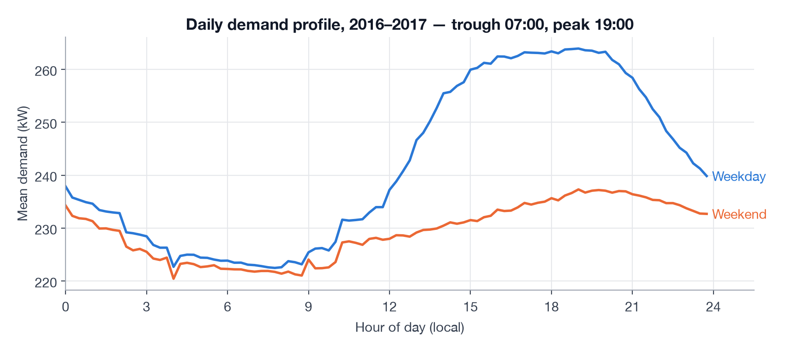

*Figure 1. Hourly mean demand, 2016–2017. This is not an office profile — an office peaks mid-afternoon and empties after 18:00. A laboratory building runs a large 24-hour base load with a modest daytime rise and an evening peak; the trough is only 13 % below the peak. The model is not told any of this; the features let it learn the shape.*

### 3.2 Weather

The repository came with two Weather Underground exports produced by Selenium scrapers — one metric (2016-01 to 2020-02), one imperial (2015–2019) — with `Pressure == 0` sensor nulls, a 294 km/h "gust", and an end date fourteen months before the demand data. A scraper is not a production source.

The system uses the **Open-Meteo historical archive** (ERA5/ERA5-Land reanalysis, free, no key) for the building's location: **56,232 hourly rows**, 2015-01 to 2021-05, seven variables — temperature, dew point, relative humidity, wind speed, wind gusts, surface pressure, precipitation — in metric units. Open-Meteo also provides forecast and current-conditions endpoints for the live case.

Reanalysis is a model, not a thermometer, so it was validated against the station export on the **35,808 overlapping hours**:

| Variable | r | MAE | Assessment |
|---|---|---|---|
| temperature | **0.984** | 1.95 °C | excellent |
| dew point | **0.983** | 1.66 °C | excellent |
| surface pressure | **0.978** | 25 hPa | constant offset (station altitude vs modelled surface); harmless to a tree model |
| relative humidity | 0.795 | 8.8 % | fair |
| wind speed | 0.767 | 4.6 km/h | fair |
| gusts | 0.621 | 24 km/h | the station column is mostly zeros — the export is the unreliable side |
| precipitation | 0.310 | 0.14 mm | reanalysis precipitation is spatially coarse; treated as a weak feature |

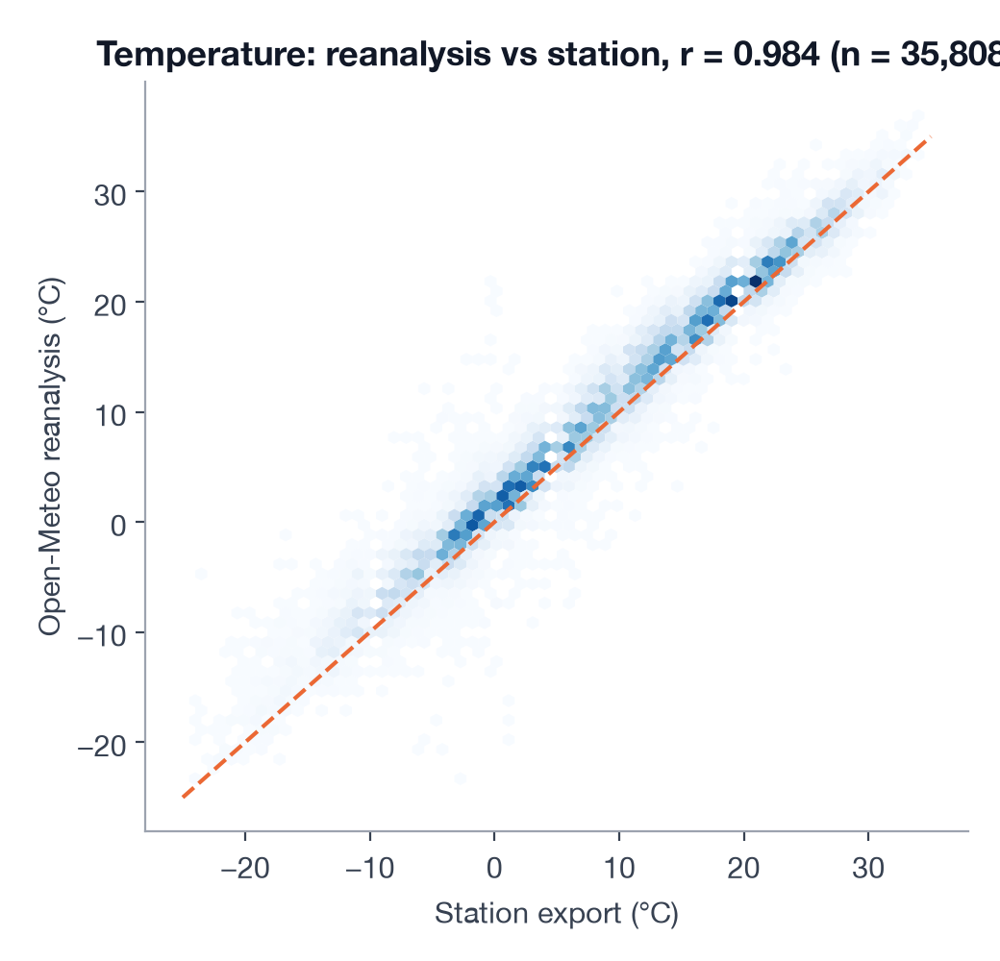

*Figure 2. Open-Meteo reanalysis against the station export on 35,808 overlapping hours. Temperature, the variable that matters most, agrees to r = 0.98; the dashed line is y = x.*

The station CSVs remain as an offline fallback behind a loader that normalises units (°F→°C, inHg→hPa, mph→km/h, in→mm) and nulls impossible values.

**Alignment to the grid.** Observations are rounded to the hour (keep-last on collisions) and carried across at most four 15-minute slots (`ffill(limit=3)` after the on-the-hour value), so an hour with no observation stays `NaN` for the imputer rather than inheriting a stale value across a gap.

### 3.3 Splits

| Split | Period | Rows (non-missing) | Used for |
|---|---|---|---|
| train | 2016-01-01 to 2017-12-31 | 68,538 | boosters, weather imputer |
| calibrate | 2018 | 34,974 | band factor and every rule threshold |
| test | 2019 | 34,922 | evaluation with injected anomalies |
| replay | 2020-01-01 to 2021-05-31 | 48,172 | streamed through the live system |

`temporal_split()` refuses overlapping or out-of-order bounds. Testing on a full year matters: an early draft tested on 2020-Q1, which would have evaluated every anomaly type in winter only.

## 4. Feature engineering

Seventeen features, all computable from the timestamp and the current weather observation; nothing about the demand itself.

### 4.1 Calendar, in local time

Cyclic quantities are encoded as points on a circle so that the model's notion of distance matches reality — 23:45 is next to 00:00, December next to January, Sunday next to Monday:

```
sin_tod, cos_tod = sin(2π·m/1440), cos(2π·m/1440)     m = minute of day (0…1439)
sin_dow, cos_dow = sin(2π·d/7),    cos(2π·d/7)        d = day of week
sin_doy, cos_doy = sin(2π·y/365.25), cos(2π·y/365.25) y = day of year
```

Trees can split a raw hour; the reason to encode cyclically is the wrap-around. A raw `hour` needs two splits to isolate 23:00–01:00, and a raw `day_of_year` places 31 December and 1 January at opposite ends of its range. Minute-of-day is used rather than hour plus a minute one-hot (the prototype's approach) so that a single smooth variable lets the model place a split at 07:15 if that is when the building wakes.

`is_holiday` (US federal, via the `holidays` package) and `is_weekend` are explicit flags. Holidays cover 2,208 training slots (23 days). Both are computed on the *local* date — 4 July 23:00 local is 5 July 03:00 UTC, and a test guards that it still counts as the holiday.

### 4.2 Weather

The seven Open-Meteo variables enter directly, plus two derived terms:

```
hdd = max(18 − T, 0)      heating degrees: how far below the comfort band
cdd = max(T − 22, 0)      cooling degrees: how far above
```

Buildings respond to temperature piecewise — nothing between roughly 18 and 22 °C, then linearly in each direction. Supplying the two half-lines means the model need not discover the kink from splits on raw temperature, and keeps the two behaviours separable when one is weak. Training temperatures span −23.3 to 33.9 °C, so both regimes are well covered.

Wind speed, gusts, humidity, dew point and pressure are kept although several are weak: they are cheap, the model can ignore them, and pressure and humidity carry the cloud-cover and precipitation information that the coarse `precip_mm` measures badly. The 45-category `Condition` text from the station export was dropped: its information is in the numeric variables, and a 45-level categorical from a scraped source is a maintenance liability.

### 4.3 Missing weather

`SeasonalMeanImputer` fills a missing variable with the **training-period mean for that (month, hour) in local time**, falling back to the global training mean for a cell never seen in training. Weather is seasonal and diurnal: a 7 a.m. January temperature imputed from a January-7-a.m. mean is a far better guess than a global mean, and far better than carrying yesterday's value across a multi-day gap. The imputer is fit on 2016–17 only and is part of the saved model artefact. In live operation the scorer uses it when the weather feed is stale (§10.2).

### 4.4 Deliberately not a feature: demand lags

A lag feature (`kw` fifteen minutes ago, same slot yesterday, same slot last week) is the single most predictive input for a forecaster. It was excluded on purpose; this is the central design decision of the model.

- A model with lags answers *what will the next reading be*; a context model answers *what should this building be drawing now*. The second is the question a sustainability programme asks.
- With lags, a sustained anomaly becomes the model's normal within a few readings. The +30 % overnight HVAC event — the one that costs the most energy — is exactly the one a lag model stops seeing.
- Everything a lag model would contribute for slow level changes is provided by the level tracker (§7.2), which adapts over days rather than minutes and is robust to anomalies by construction.

The cost is sensitivity to *small* offsets: the context model's band (median σ ≈ 9 kW, about 4 % of load) is wider than a lag model's would be. The floor is measured in §9.2: six-hour offsets are caught reliably from about +12 %; at +8 % half are missed. A second, lag-based model behind the same `Detector` interface is the documented extension should that matter (§13).

### 4.5 What the model uses

Linear correlations with demand on the training set, and LightGBM gain importance for the median booster:

| Feature | r with kW | Gain share (q50) |
|---|---|---|
| sin_tod | −0.641 | **37.6 %** |
| cos_doy | 0.080 | 12.2 % |
| sin_doy | 0.083 | 11.6 % |
| sin_dow | 0.247 | 10.9 % |
| dewpoint_c | −0.076 | 5.3 % |
| pressure_hpa | −0.031 | 5.0 % |
| temp_c | 0.029 | 4.7 % |
| cos_tod | 0.036 | 2.8 % |
| hdd | 0.034 | 2.0 % |
| gust_kph | 0.112 | 1.7 % |
| rh | −0.265 | 1.7 % |
| cos_dow | −0.101 | 1.5 % |
| wind_kph | 0.055 | 1.4 % |
| is_holiday | −0.081 | 1.0 % |
| cdd | 0.215 | 0.4 % |
| precip_mm | −0.005 | 0.3 % |
| is_weekend | −0.291 | 0.0 % |

Three observations. Time of day dominates, as expected. The day-of-year pair carries 24 % of the gain while its linear correlation is near zero: seasonality is real but non-monotonic, precisely the case where trees beat a linear model and where cyclic encoding earns its place. And `is_weekend` has zero gain despite a −0.29 correlation, because `sin_dow` already carries the information; the flag is redundant but kept for readable SHAP explanations.

Weather matters less than intuition suggests for this building: temperature, dew point and pressure together take about 15 % of the gain — consistent with a laboratory whose load is dominated by equipment and always-on ventilation rather than by weather-driven cooling.

## 5. Model selection

### 5.1 Requirement

For every 15-minute slot the detector needs an **expected value** and a **normal range** given the context, and both must be explainable in one sentence to a non-engineer. That requirement rules out the family the project started with.

### 5.2 Candidates

**A — Residual-based (chosen).** Predict conditional quantiles of demand from context with gradient-boosted trees; the anomaly signal is the signed, standardised residual of the observation against the median, with the 5–95 % quantiles giving the band.

**B — Autoencoder (the incumbent).** Reconstruction error of a window plus context. Direction-blind (§2); the threshold is a number on an error scale nobody can interpret; and its inputs include the demand itself, so it learns neighbours. It *can* catch within-hour shape anomalies (an oscillating compressor) that a point model cannot. Kept as a possible second signal, not the core.

**C — Ensemble of A and B.** Marginally more recall on a single meter for twice the operational surface and two thresholds to explain.

**Why boosting rather than a neural forecaster** (LSTM, TFT, N-HiTS). Three reasons. Some 70,000 rows of tabular features is a regime where gradient boosting is routinely at or above neural models. Quantile loss gives calibrated bands natively, where an LSTM needs a quantile head or a conformal wrapper. SHAP on trees is exact and takes microseconds, which is what makes the alert text possible — and training takes about ten seconds on a laptop CPU, so nightly retraining is trivial. Deep models earn their place with many buildings (a global model) or sub-minute data; neither applies here.

**Why quantile regression rather than mean regression plus a residual σ.** The band should be heteroscedastic: the building is more variable at 19:00 than at 04:00 and more variable in a heat wave than in mild weather. Three quantile boosters learn that structure directly. On the calibration year the raw half-width's 10th–90th percentile range is 6.1–12.9 kW around a median of 9.1 — a factor of two between quiet and busy contexts that a constant σ would get wrong in both directions.

### 5.3 The model

Three LightGBM regressors with `objective="quantile"` at α = 0.05, 0.50, 0.95; 800 trees, learning rate 0.03, 31 leaves, `min_child_samples = 50`. Each minimises the pinball loss:

```
L_α(y, q) = α·(y − q)          if y ≥ q
          = (α − 1)·(y − q)    otherwise
```

Predicted quantiles are re-sorted row-wise so that `q05 ≤ q50 ≤ q95` (crossing is rare but real with independently fitted boosters). Fit on the training years, the median model's calibration-year error is **MAE 9.95 kW** on a 237 kW mean (4.2 %), pinball loss 4.97.

## 6. Calibration

Independently fitted quantile models are almost always overconfident out of sample: on 2018 the raw 5–95 % band covered only **59.9 %** of readings. Calibration adds one scalar `c`, chosen so that the band covers the target 90 % on the calibration year:

```
half = c · (q95 − q05) / 2         lower, upper = expected ∓ half
σ    = half / 1.645                z = (y − expected) / σ
```

Dividing by 1.645 rescales the calibrated half-width to a standard-normal-equivalent σ, so `|z| > 4` means what it sounds like. A per-(hour, weekday) σ table and a full split-conformal procedure were considered and rejected: one scalar on top of heteroscedastic quantiles captured the structure, and a test asserts calibration-year coverage of 0.90 ± 0.02.

**Which residual the factor is fit on turned out to matter more than the method.** The first version fit `c` on the raw residual `y − q50` and obtained **c = 2.12**. After the level tracker was introduced (§7.2) and calibration was made to use the same level-adjusted residual the scorer uses, `c` fell to **1.59**. The difference — a third of the band's width — was year-scale level drift that the raw residual contained and the tracker removes (§7.3).

## 7. From residual to alert

### 7.1 The first rule set and why it failed

The obvious detector: `SPIKE_HIGH/LOW` when `|z| > 4` on a single slot; a two-sided **CUSUM** on z for sustained deviation; `STUCK` for eight identical consecutive readings. CUSUM keeps two running sums,

```
s⁺ ← max(0, s⁺ + z − k)        s⁻ ← max(0, s⁻ − z − k)        alert when either exceeds h
```

where k is the persistent bias tolerated per step and h the evidence that must accumulate. With the textbook k = 0.5, h = 5, the first version fired **12 false alarms per week** on the held-out year: 626 alert events, 9,462 slots of `SUSTAINED_LOW` alone.

Diagnosis on the 2019 z series:

- lag-1 autocorrelation **0.79**;
- monthly mean z from **−2.0 in January to +0.75 in November**; overall mean −0.56 — 2019 ran lower than 2016–17 in the same contexts;
- on roughly one day in four, the day's mean |z| exceeded 1.

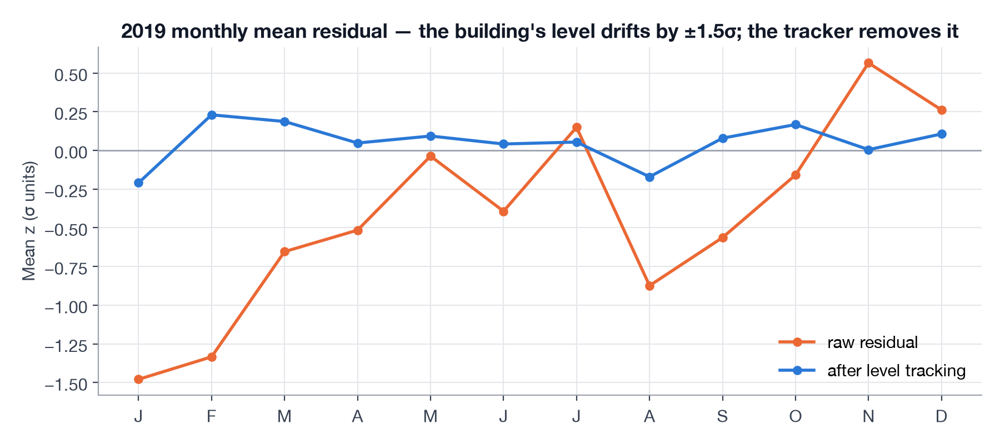

*Figure 3. Monthly mean of z on the held-out year. Orange: the raw residual against the 2016–17 model — the building runs 2σ low in January and 0.75σ high in November. Blue: the same residual after the level tracker of §7.2; January's blue point is the tracker warming up from zero. CUSUM sees the blue line.*

A context-only model trained on 2016–17 cannot know that the building runs 2σ lower in January 2019 than in January 2017. CUSUM with k = 0.5 correctly accumulates any persistent bias above 0.5σ and flagged entire months. The mathematics was correct; the alerts were useless.

Two textbook defaults were also wrong for this cadence. Each one-sided CUSUM with k = 0.5, h = 5 has an in-control average run length of roughly 465 steps on *white noise* — at 96 readings a day, a false "sustained" alert every five days in each direction before any real structure is considered. The unit test that fed 1,000 N(0,1) values into it failed, which is how the defect was found. And a single extreme reading (z = 30) tripped CUSUM on its own and was labelled "sustained".

### 7.2 Level tracking

The fix that preserved the one-model design: a **slow, robust exponentially weighted moving average of the kW residual** tracks the building's current level relative to the model. Expectation, band and z are all computed relative to it:

```
expected  = q50 + level_kw
z         = (y − expected) / σ
level_kw += α · clip(y − expected, −2σ, +2σ)        α = 1 − 0.5^(1 / (3 days · 96))
```

Four properties, each the result of a failed test rather than a prior:

1. **Track in kW, not in z.** A first version tracked the bias in σ-units. Because σ varies with context (§5.2), `bias·σᵢ` produced a different kW correction at every slot and left a ±2σ daily oscillation after a pure level shift. A level shift is a kW quantity.
2. **Clip each update at ±2σ.** Unclipped, a +30 % offset lasting six hours pulled the level up enough that the return to normal produced a *rebound* `SUSTAINED_LOW` alert. Clipped, an anomaly moves the level by at most 2σ·α per slot — about 0.12σ over a six-hour event — while a permanent −20 kW shift is still fully absorbed within one to two weeks.
3. **A three-day half-life.** Long enough that no realistic anomaly is absorbed before it alerts; short enough that a genuine regime change (a retrofit, a lockdown) stops alerting within a week. Anything persisting beyond that *is* the new normal, and the nightly retrain will learn it properly.
4. **Clip the CUSUM input at the spike threshold.** With z clipped to ±5 before accumulation and k = 1.5, one slot contributes at most 3.5 toward h = 12, so `SUSTAINED` means at least an hour of deviation and a single spike can never masquerade as one.

One further rule of alert hygiene: **`SUSTAINED` supersedes `SPIKE` in the same direction.** A spike that keeps going *is* the sustained event; the manager sees one alert, and the spike record closes when the sustained one opens.

### 7.3 Calibrating on the residual the scorer scores

This inconsistency was found by the promotion gate, not by inspection. The first automated retrain (as of 2020-09-01) calibrated its band on March–May 2020 — the lockdown. Raw residuals in a regime break are large, so `c` inflated until the candidate's band covered **100 %** of readings and detected nothing. The gate refused it (§11.3).

The cause: the scorer judged *level-adjusted* residuals while the calibrator was fit on *raw* ones. Both now share one `track_level()` routine; the factor is fit on `y − level` with a three-step fixed-point iteration (the tracker's clipping depends on σ, which depends on `c`). A unit test asserts that the coverage reported at calibration equals the coverage `Detector.score()` realises on the same frame across a −30 kW mid-window break; they now agree within 0.015, where before the fix they differed by 0.04. The same suite pins that batch scoring and one-reading-at-a-time scoring produce identical output, so what is evaluated is what runs.

### 7.4 Threshold selection on the calibration year

With level tracking in place, a small grid was evaluated with injected anomalies on **2018**; 2019 was not used for tuning (see the two-pass disclosure in §8.4).

| k | h | spike z | False alarms/week (clean 2018) | recall: offset · dropout · spike · drift · schedule |
|---|---|---|---|---|
| 1.0 | 12 | 4 | 2.57 | 1.0 · 1.0 · 1.0 · 1.0 · 1.0 |
| 1.0 | 16 | 5 | 1.98 | 1.0 · 1.0 · 1.0 · 1.0 · 1.0 |
| **1.5** | **12** | **5** | **1.11** | **1.0 · 1.0 · 1.0 · 1.0 · 0.83** |
| 1.5 | 16 | 5 | 1.02 | 1.0 · 1.0 · 1.0 · 1.0 · 0.83 |
| 2.0 | 12 | 5 | 0.61 | 1.0 · 1.0 · 1.0 · 1.0 · 0.83 |

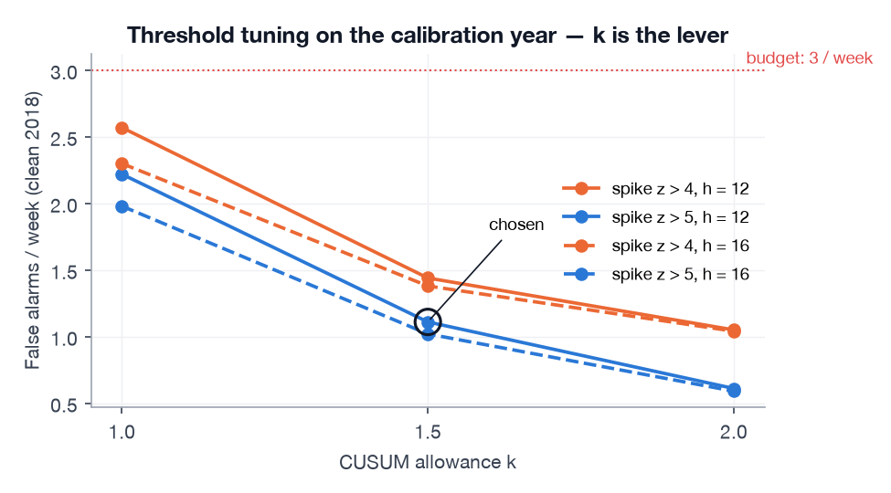

*Figure 4. False alarms per week on the clean calibration year for each rule setting. Recall was 1.0 on five of six types for every point shown; the chosen setting is circled.*

`k` — how much persistent bias CUSUM tolerates — is the dominant lever; `h` and the spike threshold are second-order. k = 1.5 was chosen over 2.0 to keep sensitivity to offsets around +10 % (the overnight-waste case) at the cost of about half an extra false alarm a week. Final rules: `spike_z = 5`, `cusum_k = 1.5`, `cusum_h = 12`, `stuck_slots = 8`; an alert closes once eight in-band readings have been seen since it last fired; level half-life three days.

## 8. Evaluation without labels

### 8.1 Injection

Anomalies are injected into the **raw** demand series before anything else runs, so imputation, level tracking and the rules see exactly what production would see. Six types, chosen to span what a facilities team encounters:

| Type | Simulates | Injected as | Detection challenge |
|---|---|---|---|
| spike | transient load, meter glitch | one slot × U(1.3, 2.0) | must not be swallowed by smoothing |
| sustained_offset | HVAC or lighting left on | +U(15, 40) % for 2–12 h | the core waste case |
| dropout | equipment failure | −U(30, 60) % for 1–6 h | direction |
| slow_drift | degradation, fouling | linear ramp to +14 % over 14 days | must not be absorbed as level |
| schedule_shift | day profile running at night | one day's readings rolled by 6 h | net energy unchanged; only context reveals it |
| stuck_meter | communications or metering fault | constant value for 2–6 h | not a deviation at all |

Three of each per seed, five seeds, placed at least a day apart (longest types first, so fourteen-day drifts are not squeezed out by earlier placements): 15 events per type, 90 per evaluation, on top of a year of real behaviour. With 15 events, recall is quantised to 1/15 — "0.93" is one miss. Time-to-detect is the mean over seeds of each seed's median.

### 8.2 Metrics

Event-level, not slot-level. A labelled event is **detected** if any alert overlaps it within ±1 hour; **time-to-detect** is the delay from onset to the first overlapping alert slot. On the clean, un-injected year: **false alarms per week** (alert events overlapping no label) and **band coverage** (share of readings inside the band).

Precision and F1 are computed and logged but not used for decisions. With three injected events per type against a full year of real alerts, F1 is a proxy for the false-alarm count; recall per type, false alarms per week, time-to-detect and coverage are the four numbers an operator would ask for.

### 8.3 Baseline

A **seasonal-naive** detector: expected demand = the reading at the same slot last week (falling back to the (weekday, slot) mean), σ = the (weekday, slot) standard deviation from the fit period, run through the *same* calibrator and the *same* alert rules. Only the source of the expectation differs, so the comparison isolates what the model contributes. This baseline is strong on a stable building and is the one most practitioners would try first. Two asymmetries favour it: its profile is fit on 2018, a year fresher than the boosters' 2016–17, and its band factor is fit on the raw residual (the detector's on the level-adjusted one, §7.3), which makes its band somewhat wider and quieter. Both make the comparison conservative.

### 8.4 Guardrails

- Thresholds were set on 2018; 2019 was scored for the report.
- Injection positions and magnitudes are drawn with fixed seeds and were not adjusted to what the detector catches. The tuning runs on 2018 and the first 2019 run used the same seeds, so events landed at the same slot positions in both years; §9.1 therefore reports 2019 with a **disjoint seed set** as well.
- The whole 2016–2021 series was scored once as a sanity check for the two regime changes the data itself labels (§9.3); no parameter was changed as a result.
- **Disclosure: 2019 was scored twice.** The first pass (k = 1.0, spike z > 4, band factor fit on raw residuals) gave 1.84 false alarms/week, coverage 0.91, recall 0.93–1.00, and passed the gate. The calibration change of §7.3 narrowed the band; false alarms on *2018* rose to 2.6/week at k = 1.0, so the grid of §7.4 was re-run on 2018 only and gave k = 1.5, spike z > 5. The numbers reported are from the second pass and should be read as post-one-revision, with the first pass as evidence that the revision did not cherry-pick.

## 9. Results

### 9.1 Held-out year, 2019

Each recall and time-to-detect cell reads *tuning seeds / disjoint seeds*: seeds 0–4 place events at the same positions as the 2018 tuning runs; seeds 5–9 are independent. False-alarm rate and coverage are measured on the clean year and do not depend on seeds. n = 15 events per type per seed set.

| | Detector | Seasonal-naive |
|---|---|---|
| False alarms / week, clean | **1.73** | 0.75 |
| Band coverage, clean | 0.81 | 0.88 |
| Recall — spike | 1.00 / 1.00 | 1.00 / 0.87 |
| Recall — sustained offset | 1.00 / 1.00 · detected in **12 / 0 min** | 1.00 / 0.93 · 54 / 27 min |
| Recall — dropout | 1.00 / 1.00 | 1.00 / 1.00 |
| Recall — slow drift | 0.93 / 1.00 · ~2.5 / 2.1 days | 0.80 / 0.93 · ~6 days |
| Recall — schedule shift | 1.00 / 0.80 · ~4.4 / 6 h | 0.80 / 0.67 · ~7.4 / 7.1 h |
| Recall — stuck meter | 1.00 / 1.00 · 96 / 105 min | 1.00 / 1.00 · 105 min |

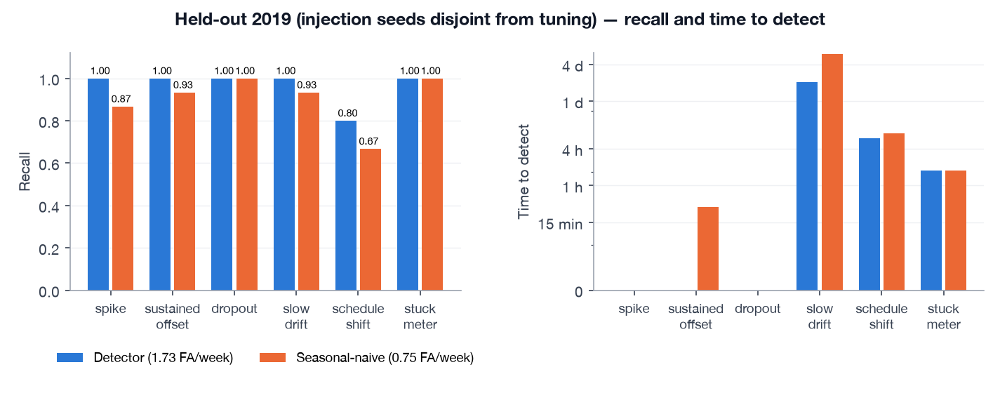

*Figure 5. Held-out 2019 with the disjoint seed set: recall (left) and median time to detect (right, log scale) per injected anomaly type, detector vs seasonal-naive baseline; false-alarm rates on the clean year in the legend.*

Interpretation:

- Within the 3/week budget, the detector matches or beats the baseline's recall on every type and is faster on four of six. Sustained offsets are caught on the first anomalous reading when z > 5 (the spike rule), otherwise by CUSUM within an hour. Schedule shift separates the two most clearly: the baseline compares to last week's reading at the same slot, so a building running its day profile at night looks plausible if it did so last week too; only the context model knows that 02:00 on a Tuesday should be quiet.
- The baseline is *quieter*, at 0.75 false alarms a week, because last week's reading already contains the building's current level (and because of the asymmetries noted in §8.3). It pays with blindness to anything that also happened last week, and with slower reaction.
- **Coverage 0.81** for a band calibrated to 0.90 on 2018 is a real finding: the median model's MAE rises from 9.95 kW on 2018 to 11.15 on 2019 and pinball loss from 4.97 to 5.57. A model frozen at end-2018 fits 2019 measurably worse; §9.4 follows that curve through 2021.
- On 2018, the year the rules were tuned on, the same configuration gives 1.11 false alarms/week and coverage 0.90. The 2019 numbers are worse, as an out-of-year result should be.

### 9.2 The sensitivity floor

Section 4.4 claimed that excluding demand lags costs sensitivity to small offsets. Measured, with twenty six-hour offsets per magnitude injected into 2019:

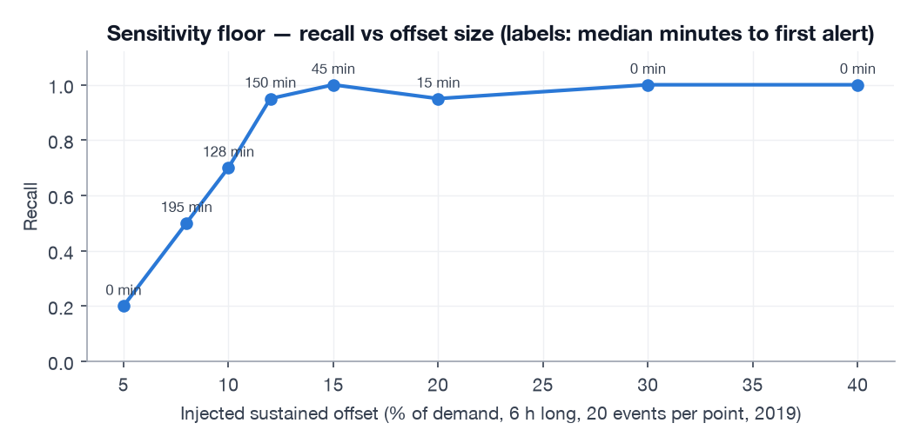

*Figure 6. Recall of six-hour sustained offsets by size, twenty events per point; labels give the median time to the first alert.*

| Offset | +5 % | +8 % | +10 % | +12 % | +15 % | +20 % | +30 % |
|---|---|---|---|---|---|---|---|
| Recall | 0.20 | 0.50 | 0.70 | 0.95 | 1.00 | 0.95 | 1.00 |
| Median time to alert | — | 3.3 h | 2.1 h | 2.5 h | 45 min | 15 min | 0 min |

Reliable detection starts around **+12 %** (about 28 kW on this building); at +8 % half the events are missed and the rest take three hours. That is the price of a context-only expectation, and the number to weigh against any proposal for a lag-based second model.

### 9.3 The replay through the live system

The complete 2020-01 to 2021-05 period — real readings only, no injection — streamed over MQTT into the deployed stack: **48,173 score rows for 48,172 readings** (the extra row is a boundary slot), zero message loss, about 15 ms scoring latency per reading. Alerts per month:

| Month | Alerts | LOW | HIGH | Excess kWh | Note |
|---|---|---|---|---|---|
| 2020-01 | 14 | 6 | 8 | 102 | 3.2/week — inside the budget but above 2019's 1.7; also the level tracker's warm-up month |
| 2020-02 | 9 | 1 | 8 | 211 | |
| 2020-03 | 16 | **13** | 3 | 33 | lockdown begins; mean alert duration 34 h |
| 2020-04 | 20 | **14** | 6 | 54 | |
| 2020-05 | 31 | 2 | **29** | 816 | partial reopening reads as *high* against the newly learned low level |
| 2020-06 to 2021-05 | 8–26 / month | | | | elevated relative to 2019, with a model two years stale |

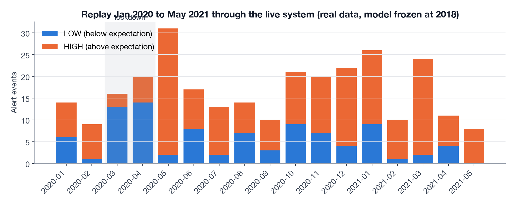

*Figure 7. Alert events per month from the live replay of real readings, coloured by direction. The frozen 2018 model sees the lockdown as weeks of "below expectation", then partial reopening as "above" the newly learned level. Offline scoring of the whole 2016–2021 series gives the same picture: 939 and 1,260 `SUSTAINED_LOW` slots in March and April 2020, almost nothing in the training years.*

The March–May 2020 sequence is what a manager would want explained on the dashboard: first "the building is running far below what it should" for weeks, then "it is running above what it just was". Whether the second wave is *useful* depends on the question being asked; it is correct relative to the recent level.

### 9.4 A frozen model over four years

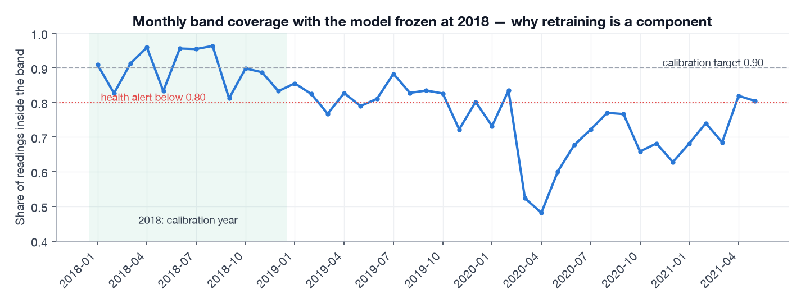

*Figure 8. Share of readings inside the band, by month, with the model frozen at 2018. Calibrated to 0.90 in 2018; 0.82 in 2019; 0.68 in 2020; 0.75 in 2021. Seventeen of forty-one months sit below the 0.80 health line; the Grafana coverage rule would have been firing for most of the replay.*

Yearly coverage: 2018 **0.90**, 2019 **0.82**, 2020 **0.68**, 2021 **0.75**. This is the quantitative case that retraining is a component of the system rather than an option (§11), and it is why the replay's alert density stays elevated after the lockdown: a band that covers 68 % of readings raises alerts on the other 32 %.

## 10. Deployment

### 10.1 Shape

Five always-on containers, two on demand, one image, one `docker compose up`:

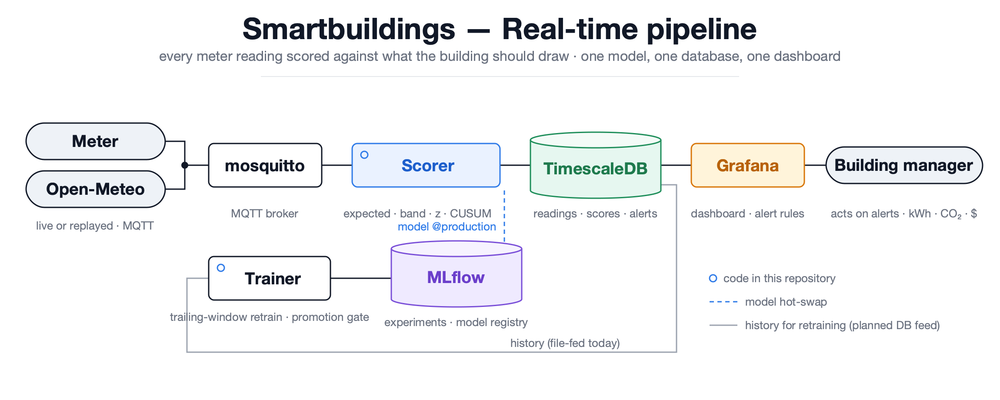

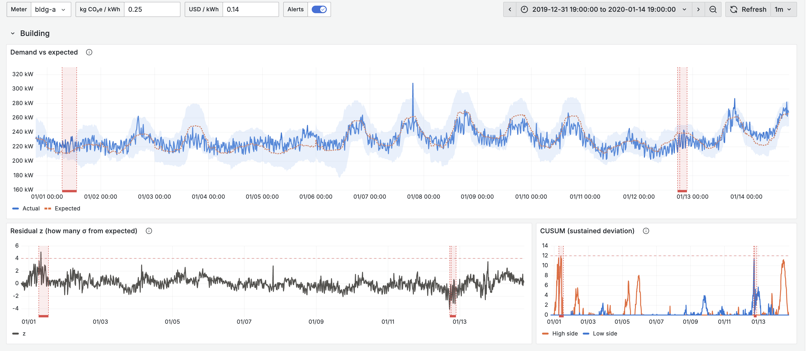

*The dashboard a building manager sees: actual vs expected with the 90 % band, the residual and CUSUM, alerts as red bands, and the sustainability tiles (excess kWh, CO₂e, cost) below. Two weeks of real readings, January 2020.*

Design choices:

- **MQTT as the single integration contract.** Topic `building/<meter_id>/demand`, payload `{"meter_id", "ts", "kw"}` with an ISO-8601 timestamp *including offset* (naive timestamps are rejected so that no component has to guess a time zone), QoS 1. Weather on `weather/<station_id>/obs` with the seven metric variables. A real meter gateway and the replay simulator publish identical messages; swapping mosquitto for a managed broker is a `.env` change.
- **TimescaleDB rather than a document store.** Every question the dashboard asks is a time-range aggregate over 15-minute rows; hypertables and plain SQL are the natural fit, and Grafana's Postgres datasource needs no glue. Three hypertables (`readings`, `weather_obs`, `scores`) and two tables (`alerts`, `model_versions`).
- **One scoring path.** `Detector.score()` serves offline evaluation, the live scorer and the MLflow pyfunc wrapper.
- **No separate metrics stack.** Service health and model health are SQL over `scores` (§11.1). A second metrics system would have been the first violation of the one-database goal.

### 10.2 The scorer

A transport- and storage-agnostic `ScorerCore` behind a `Sink` protocol (unit-tested with an in-memory sink), wrapped by a thin paho-mqtt consumer and a FastAPI app exposing `/health` and `/reload-model`. Per meter it keeps the level, CUSUM sums, stuck-run counter and open alerts; one lock guards all state.

Behaviour under the failure modes that actually occurred:

| Failure | Symptom | Handling | How it was found |
|---|---|---|---|
| Stale or missing weather (> 3 h) | features would be `NaN` | seasonal-mean imputer; score row flagged `weather_stale` | designed in; unit test |
| Out-of-order or duplicate reading | state corruption | dropped with a warning | unit test |
| Reading more than a day older than the last | replay restarted; 1,439 readings rejected as out of order | treated as a new session; meter state reset | truncating the database under a running scorer |
| Database restart | every later reading silently dropped while the container stayed "healthy" | sink reconnects once and retries | code review |
| Unthrottled replay outrunning the scorer (~25 readings/s) | mosquitto's default 1,000-message queue dropped 75 % of readings | queue unbounded; backfill capped at ~30,000× (17 months in ~40 min) | backfill count vs raw readings |

Every alert record carries observed vs expected kW, peak z, accumulated excess kWh → CO₂e → cost, the model version, and the top-3 SHAP drivers of the expectation ("time of day +38 kW, weekday +12, temperature −6"), so the manager sees why the model expected what it expected — an explanation of the baseline, not of the cause of the anomaly.

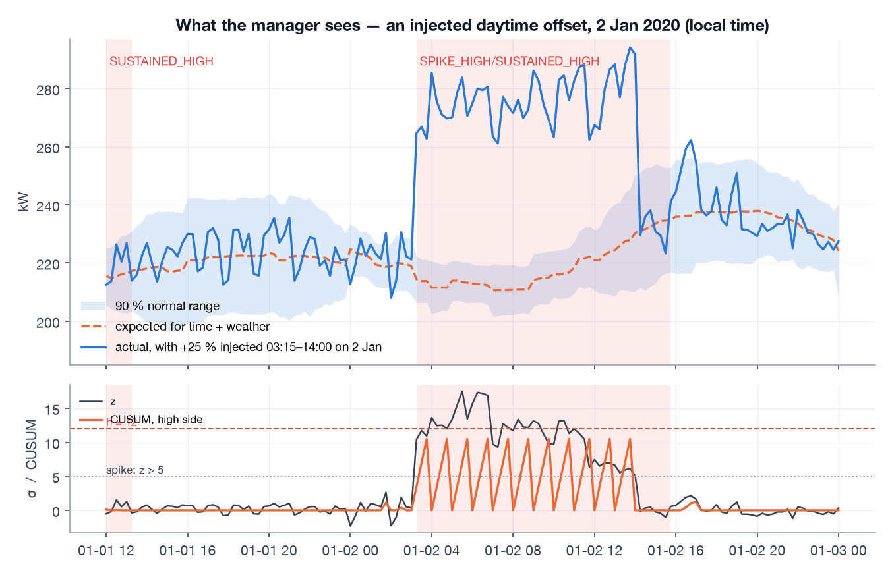

*Figure 9. Two days of real readings with a +25 % offset injected from 03:15 to 14:00 on 2 January (top), and the residual z with the high-side CUSUM (bottom). The spike rule opens the alert on the first anomalous reading (z > 5); CUSUM crosses h = 12 four readings later and takes over. The alert closes at 15:45, once eight in-band readings have been seen. The small alert at noon on 1 January is the building's own New Year's Day behaviour. The band lifts slightly during the offset — the level tracker's clipped, deliberately slow response.*

### 10.3 Model registry and hot-swap

Models are logged to MLflow as a pyfunc bundling the three boosters, the imputer, the calibration factor and the rules; aliases `@staging` and `@production` are used (stages are deprecated). The scorer loads `@production` at start-up, polls the alias every ten minutes and hot-swaps without restart.

A code-review reproduction showed that a naive swap carried the **old** model's level bias — a kW offset relative to the *old* model's median — into the new one, producing nine spurious alerts on a quiet day right after a promotion. On swap the level is now reset (the new model re-learns it within its half-life) and CUSUM is rebuilt with the new model's rules while carrying its sums; open alerts and the last timestamp survive. A test drives the whole sequence.

### 10.4 Replay as the deployment test

The replay simulator publishes historical readings at a chosen speed: 1× is real time (one reading per 15 minutes), 96× plays a building day in fifteen real minutes for a demonstration, 30,000× backfills history. Timestamps are never re-stamped to the present — that would put January weather and a January day-of-year against a September clock and corrupt the expectations. The dashboard is simply pointed at the historical range.

## 11. Monitoring and retraining

### 11.1 Health is SQL on the scores table

The manager's dashboard carries a health row computed from `scores`: seconds since the last reading, scoring latency p95, 24-hour band coverage, 24-hour MAE, stale-weather share, and the active model version. Three provisioned Grafana alert rules: *an anomaly is open*; *no score for 30 minutes* (the pipeline is broken somewhere between meter and scorer); *24-hour coverage below 80 %* (the model is stale or the building changed). For a single meter, realised band coverage *is* the drift statistic that matters, which is why no distribution-drift library was added.

### 11.2 Retraining

Nightly by host cron (there is no scheduler container), on a trailing 24-month window split three ways: train on the oldest 18 months, calibrate on the next three, evaluate on the most recent three. Evaluation injects anomalies (two per type — a three-month window fits two fourteen-day drifts, not three) and scores the candidate, the seasonal-naive baseline **and the current production model** on the same window.

### 11.3 The gate

A candidate is promoted to `@production` only if, per anomaly type, recall ≥ 0.9 × the baseline's *or* ≥ 0.8 absolute (with ten injected events per type, recall is quantised to 0.1 and one missed event must not block a promotion); the same test against the current production model; clean false alarms ≤ 3/week and no more than one per week above production's; and coverage within 0.80–0.97. Otherwise the model is registered at `@staging` with its metrics and nothing changes.

The gate has said yes once — it promoted the initial model on the 2019 evaluation — and has refused every *retrain* candidate so far, each time for a defensible reason: the first because its band covered 100 % (the §7.3 defect), the second — trained through February 2020 and calibrated on the lockdown — because it was quieter (0.38 false alarms/week, coverage 0.91) but caught only 70 % of injected offsets where production caught 100 %. A gate that has never said no is decoration; a gate that can never say yes is a bug. What remains unverified is the retrain path passing on a healthy window, one that does not straddle the lockdown (§13).

### 11.4 Lineage

Every score row and every alert carries `model_version`, so a change in behaviour on the dashboard can be attributed to a promotion, and rollback is one alias change plus `/reload-model`.

## 12. Code review findings

Before publication the repository was reviewed against the plan by a separate, AI-assisted code-review pass that did not share the implementation session's context; this document was reviewed the same way. The findings changed the system and are recorded here because a write-up that omitted them would misrepresent how the system reached its current state.

**Fixed before publishing**

| Finding | Where | Fix |
|---|---|---|
| An 876 KB SQLite file (an empty MLflow store containing an absolute personal path) was tracked | repository | removed from all history |
| `make retrain` invoked the *training* script, not the retrain job; nightly automation would have re-pointed `@staging` at a fresh 2016–17 model every night | `Makefile` | corrected |
| Model hot-swap carried the old model's level bias into the new one (nine spurious alerts on a quiet day, reproduced by the reviewer) | §10.3 | level reset and CUSUM rebuilt on swap; test added |
| Calibration and scorer used different level trackers (reported coverage 0.900 vs realised 0.863 across a regime break) | §7.3 | one shared routine; test added |
| No database reconnect in the scorer | §10.2 | reconnect and retry |
| Recall quantisation could block promotion on one missed event | §11.3 | recall floor |
| Three inconsistent sources for the emission factor and tariff | configuration | reduced to two, documented |
| A real AWS IoT endpoint hostname in a legacy notebook | `legacy/` | scrubbed |

**Recorded rather than built**

- Retraining is file-fed (the archived CSV plus the Open-Meteo parquet), not database-fed as first planned; a small reader over `readings ⋈ weather_obs` is needed once a real meter is connected.
- The "scorer stale" Grafana rule uses wall-clock `now()` and fires during any historical replay.
- Per-type precision and F1 in the evaluation table count alerts caused by *other* injected types as false positives and are structurally pessimistic; they are not used for decisions.

**Called out as sound**: split hygiene, the single scoring path with the batch-equals-streaming test, the fairness of the baseline (last week's reading is past data, not future), thread safety and SQL parameterisation in the scorer, and the absence of any credential in the tree or its history.

## 13. Limits and next steps

- **Units and factors.** Demand is treated as kW, the EMCS portal's unit for building electric demand; this should be confirmed against the portal's export before the kWh figures are quoted. The CO₂e factor (0.25 kg/kWh) and tariff ($0.14/kWh) are placeholders. Cornell's Ithaca campus draws on a combined-heat-and-power plant, hydro and the NYISO grid, so the real factor is well below 0.25 and varies by hour; an hourly factor from the campus energy office would change the sustainability figures materially and is a straightforward join.
- **A frozen model degrades within a year** (coverage 0.90 → 0.81 → 0.68). Retraining is a component, not an option — and the gate must be shown to pass on a healthy candidate, which has not yet happened because the only windows tried straddle the lockdown.
- **Small offsets.** Below roughly 12 % the context band misses a growing share of them (§9.2). The documented extension is a second, lag-based model behind the same `Detector` interface whose residual feeds only the spike rule (never CUSUM, to avoid the new-normal problem).
- **Synthetic evaluation measures the detectability of assumed shapes.** The building's real anomalies may look like none of the six. The 2020–21 replay is the only real-world check and it is unlabelled; a period of manager feedback ("this alert was real / was not") would turn the false-alarm rate into a measured precision.
- **One meter, one weather station, one holiday calendar.** The model uses US federal holidays; Clark Hall follows Cornell's academic calendar (winter break, spring break, summer session), which is the obvious next feature and would likely explain some of the January and August residual in Figure 3. A portfolio would need per-building models or a global model with building identity, and a cold-start policy (four to six weeks of readings across a temperature range before the band is trustworthy).
- **Within-hour shape anomalies** (short cycling) are invisible to a point model; the autoencoder is the right tool there and remains the candidate second signal.
- **Live weather** needs the Open-Meteo current-conditions endpoint wired in; the replay uses the archive.

## 14. Lessons

The 2017 paper reported that an ensemble raised sensitivity by 3.6 % and lowered the false-alarm rate by 2.7 % over the best single classifier. Nine years on, the lesson of this project is that the largest gains were not in the classifier: they were in the split, the calibration, the adaptation to a building that changes, and the gate that decides when a new model may replace an old one.

1. **Profile before modelling.** Gaps, units, time zone, regimes. Half of the inherited defects were data handling.
2. **Split by time, test on a whole year, look at the test year once — and write down when you looked twice.**
3. **Build the evaluation harness before tuning anything.** Every design change in §7 was found by a number the harness produced: 12 false alarms a week, a CUSUM that trips on white noise, a rebound alert, a band covering 100 %. None was found by reading code.
4. **Decide what the model must *not* know.** Excluding demand lags was the most consequential feature decision, and it was made for an operational reason, not a statistical one.
5. **Make the deployed score the evaluated score.** One function; a test that batch equals streaming; calibrate on the exact quantity you will threshold.
6. **Design the gate to say no, then prove it can say yes.**
7. **Simplicity is a budget spent deliberately.** The level tracker, the clipped CUSUM and the supersede rule were each a few lines that replaced a second model, a second metrics stack or a second alert type.

---

## Appendix A — reproducing the numbers

```
make setup && make weather                                       # environment; Open-Meteo archive → data/processed/
uv run python scripts/train.py                                   # §5–6: fit, calibrate (2016–17 / 2018), register @staging
uv run python scripts/evaluate.py --baseline --split calibrate   # §7.4 tuning table (2018)
uv run python scripts/evaluate.py --baseline                     # §9.1 held-out result (2019)
uv run python scripts/evaluate.py --full-series                  # §9.3 regime-change check
make up && make train && make eval && make backfill              # §9.3, §10: stack + full replay
make retrain AS_OF=2020-09-01                                    # §11.3 gate behaviour
uv run --with matplotlib python scripts/figures.py               # every figure + the profiling numbers (§3, §4.5, §5–7, §9)
uv run pytest -q                                                 # 102 unit tests + 1 integration test
```

Replay counts (§9.3): `SELECT count(*) FROM scores` against the readings published; latency: `SELECT percentile_cont(0.95) WITHIN GROUP (ORDER BY latency_ms) FROM scores`; alerts by month: `SELECT to_char(started_at,'YYYY-MM'), alert_type, count(*) FROM alerts GROUP BY 1, 2`. The §7.4 grid is reproduced with `scripts/evaluate.py --split calibrate` under each rule setting.

## Appendix B — scoring quantities

| Symbol | Meaning |
|---|---|
| `q05, q50, q95` | conditional quantiles of demand for the context, from the three boosters |
| `c` | calibration factor; scales the raw half-band so that the band covers 90 % on the calibration year |
| `half` | `c · (q95 − q05) / 2` — calibrated half-width, kW |
| `σ` | `half / 1.645` — standard-normal-equivalent residual scale, kW |
| `level_kw` | robust EWMA of `y − expected`, half-life three days, updates clipped at ±2σ |
| `expected` | `q50 + level_kw` — what the building should be drawing now, given context and recent level |
| `z` | `(y − expected) / σ` — signed, standardised residual |
| `s⁺, s⁻` | two-sided CUSUM sums on `clip(z, ±5)` with allowance k = 1.5; trip at h = 12 |
| `excess_kwh` | `max(y − upper, 0) × 0.25 h` — energy above the normal range in the slot; the per-slot column is always computed, and the alert record sums it over the alert's active slots |

---

## Data source

Cornell University, Facilities and Campus Services — Energy and Sustainability. *Energy Management and Control System (EMCS) Portal*, Clark Hall electric demand, 15-minute interval, January 2015 – May 2021. https://portal.emcs.cornell.edu (accessed 2022 for the original study; re-used here). Data are the property of Cornell University and are used for research and educational purposes.
